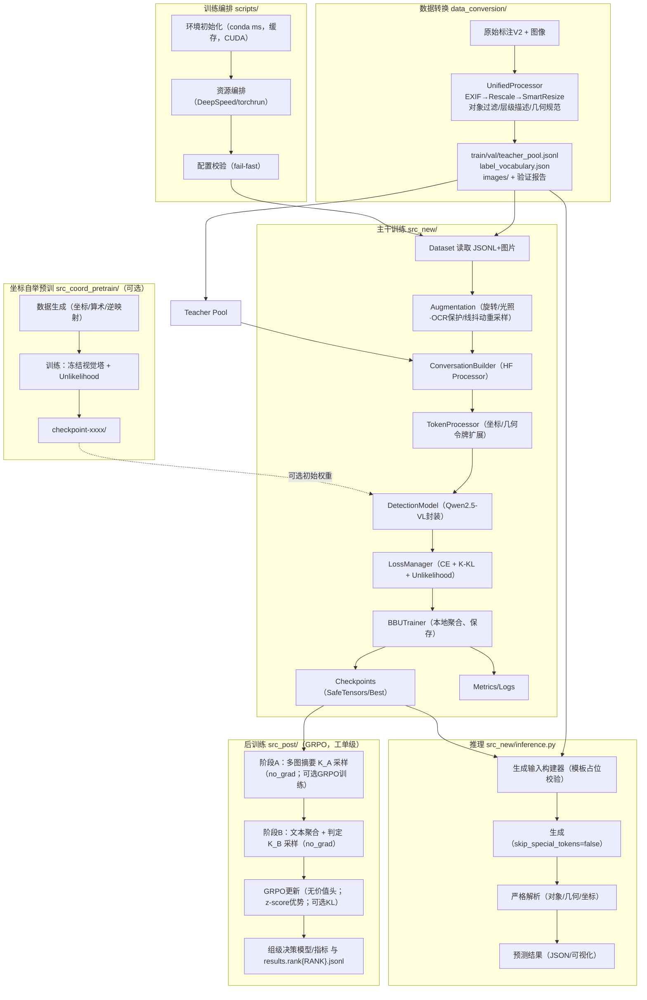

# AI研发工作汇报（BBU场景 | 端到端工作流精简版）

### 0. 项目执行摘要
- 业务价值：面向BBU通信机房，已打造一套可复用、可扩展的标准化AI质检引擎，实现数据→训练→推理→后训练的端到端闭环。
- 阶段性产出：五大模块落地（@data_conversion/、@scripts/、@src_coord_pretrain/、@src_new/、@src_post/GRPO），流程打通、质量与性能优化、规范化配置与文档齐备。
- 当前状态：单图检测与中文描述稳定可用；数据与坐标令牌体系完善；严格解析与一致性校验上线；工单级GRPO两阶段方案完成（Stage‑A摘要 + Stage‑B判定），支持单/多GPU（DDP实验特性），奖励与解析模块化。
- 下一步：开展小规模GRPO验证与看板，补充业务规则与难点场景覆盖，完善工单级提示模板以提升可解释性与最终审核准确率。

### 1. 总览
- **业务目标**：构建通信机房BBU场景的端到端AI质检能力，形成可复用、可扩展的标准化引擎。
- **整体架构**：数据转换 →（可选）坐标预训 → 主干训练与推理 → 工单级后训练（GRPO两阶段）。
- **关键点**：几何/层级严格规范；HuggingFace流水线；坐标令牌增强；工单级GRPO（两阶段“摘要→判定”，K_A/K_B，z‑score相对优势）。

### 2. 端到端工作流与模块职责
- **数据转换（@data_conversion/）**：统一多源标注与图片，完成几何规范化（EXIF/尺寸/智能缩放）、对象过滤与排序、层级中文描述、质量校验与报告、教师样本池构建。
- **训练编排（@scripts/）**：环境初始化（conda/CUDA/缓存）、资源编排（DeepSpeed/torchrun）、配置校验（fail‑fast），沉淀训练/推理一键脚本与日志规范。
- **数据增广（@augmentation/）**：图像级旋转（像素与坐标一致）、光照色彩扰动（含OCR保护）、线对象抖动与等距重采样、遮挡监测；预设可控、过程可复现。
- **坐标预训（@src_coord_pretrain/，可选）**：在不动视觉塔前提下专训坐标令牌（含Unlikelihood），为主任务提供更稳定的几何表达基座。
- **主干训练与推理（@src_new/）**：数据集/会话构造（官方Processor）、动态令牌扩展、模型封装、损失管理（CE+可选坐标辅助）、本地聚合训练、严格推理解析与一致性校验。
- **后训练（@src_post/，GRPO）**：面向“工单级”多图判定的两阶段GRPO方案：
  - Stage‑A（图像级）：每图生成一行简短中文摘要（纯文本、无引号/无特殊符号/无坐标）。
  - Stage‑B（组级）：聚合摘要后输出“总评: 通过/不通过”（不通过时给出简短原因）。
  - 训练方法：GRPO（无价值头），K_B/K_A多样本相对排序→z‑score优势；可选KL到参考策略抑制漂移；解析/奖励模块化，支持DDP（实验）。

### 3. 质量与性能
- **可靠性**：会话与图像占位严格一致；多模态张量与期望视觉令牌数双向校验；推理解码保留几何/坐标令牌并进行严格解析。
- **性能**：SafeTensors加速加载；长序列注意力优化；单次CE计算复用；词表扩展智能初始化，加速启动。
- **利用率**：PackedDataLoader（多样本打包为单长序列）+ 严格注意力掩码（防跨样本泄漏、支持跨样本位置重置），显著提升GPU吞吐与填充效率。
- **兼容性修复**：`src_new/models/patches.py` 修复官方训练相关问题（mRoPE维度双倍化、FlashAttention v2 兼容、forward/prepare_inputs清理入参、注意力实现回退）。
- **后训练稳定性（GRPO）**：
  - 奖励由`label_match/formatting/cleanliness`等正向项与`rep_penalty/quote_penalty/special_penalty`等负向项组成；支持权重配置化。
  - 相对优势（z‑score）自动尺度化；当方差过小（std≈0）时跳过更新；可选长度归一化。
  - 可选参考KL正则；多GPU下使用DDP同步梯度（实验特性），数据以索引取模手动分片，避免二次采样。

### 4. 交付与可用性
- **产出**：规范化训练/验证数据、检查点与最佳模型、推理结果与质量报告、后训练结果JSONL（`results.rank{RANK}.jsonl`）、关键文档与测试用例。
- **易用**：一体化配置与自动化编排；组件边界清晰、便于排障与维护；流程全链路可复现。
- **后训练入口**：
  - 运行脚本：`bash scripts/run_group_qc_rl.sh`
  - 最小配置关键项（`configs/rl/group_qc_grpo.yaml`）：`checkpoint`、`processor`、`train_data_dir`、`output_dir`、`K_B`、`K_A`、`train_stage_a_mode`、`stage_a_weight`、`use_ref_kl` 等。
  - 数据目录推荐：`审核通过|审核不通过/{group_id}/*.jpg`，标签统一归一为 pass/fail。

### 5. 当前进度与近期计划
- **已完成**：端到端流程打通；数据与增广策略落地；坐标预训选项稳定；训练/推理可靠性与性能显著提升；工单级GRPO两阶段实现（脚本/配置/奖励/解析）与实验性DDP支持。
- **计划**：推进小规模GRPO验证与看板，对K_B/K_A与奖励权重进行稳健性调参；强化业务规则覆盖与难点场景；完善样例回放与提示模板，以提升一致性与可解释性。

### 6. 模块化进展速读
- **@data_conversion/**：
  - 构建统一处理器（几何规范、层级中文描述、校验与报告、教师样本池），实现“多源进、规范出”。
  - 关键难点：EXIF/尺寸/智能缩放三段式坐标变换与边界修正，确保像素级一致性。
- **@scripts/**：
  - 一键训练/推理脚本，资源编排与配置校验（fail‑fast），日志与缓存规范，提升落地效率与稳定性。
  - 关键难点：DeepSpeed/torchrun集成、环境与路径自动解析，支持多场景切换。
- **@src_coord_pretrain/**（可选增强）：
  - 冻视觉塔的坐标令牌专项训练（含Unlikelihood与可选逆映射），提供稳健几何表达底座。
  - 关键难点：负采样窗口与Top‑K策略、嵌入梯度屏蔽与学习率分组。
- **@src_new/**（主干）：
  - 官方Processor驱动的HF‑First流水线：会话构造、令牌扩展、模型封装、损失管理、训练器与推理解析一体化。
  - 关键难点：长序列注意力与CE复用、坐标辅助损失、视觉令牌数一致性校验与兼容性补丁。
- **@src_post/**（工单级后训练，GRPO）：
  - 两阶段：Stage‑A（每图一行中文摘要）→ Stage‑B（组级判定 pass/fail + 可选原因）；无价值头，直接用相对优势更新策略。
  - 采样与优势：K_B/K_A多样本；z‑score标准化、裁剪；可选长度归一化；可选参考KL抑制分布漂移。
  - 解析与奖励：稳健的决策文本解析（label/原因）；奖励可组合与权重可调，支持负向重复/引号/特殊符号惩罚与评测期可选logits遮罩。
  - 训练与并行：单/多GPU运行；DDP梯度同步（实验）；手动分片（`idx % world_size`），仅rank0保存检查点。

### 14. 工作流流程图（Mermaid）

