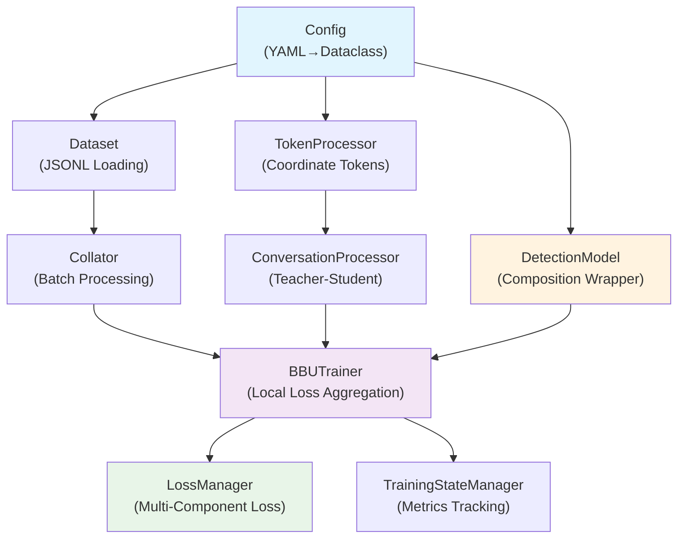
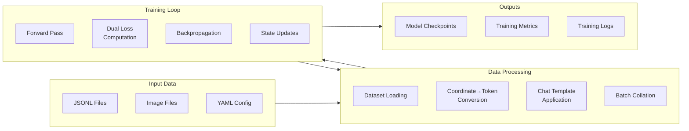
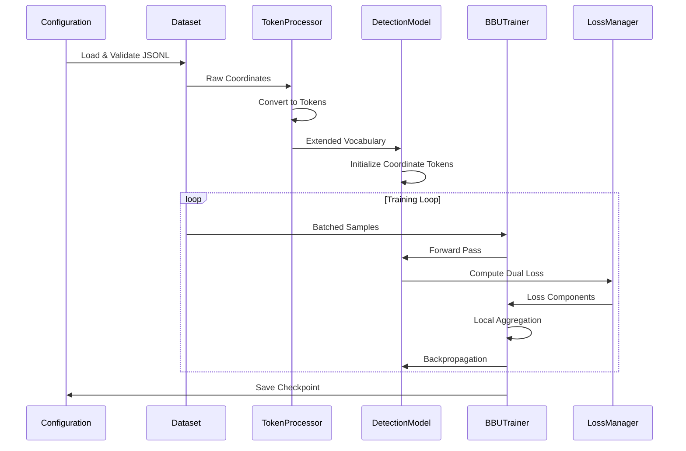
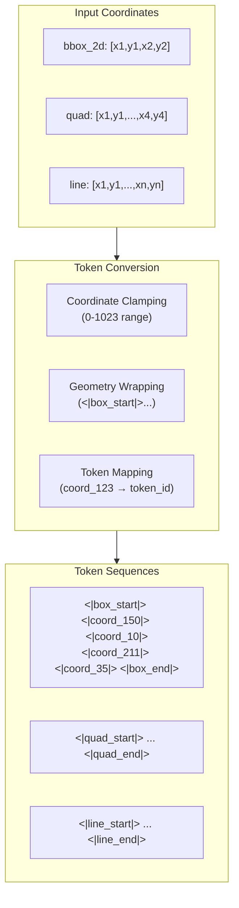
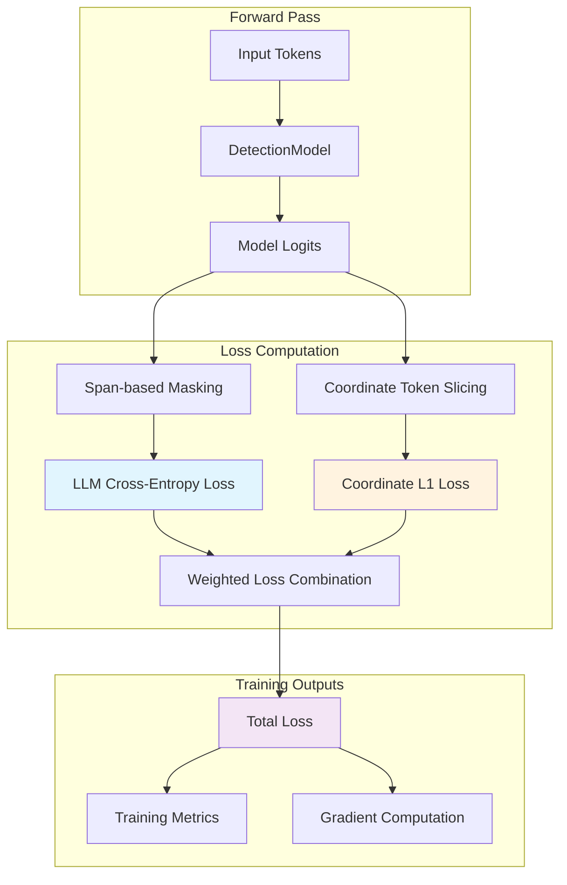
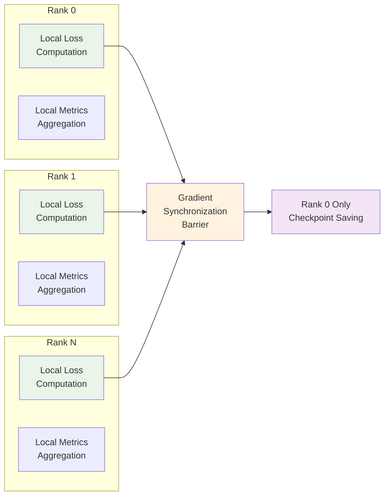
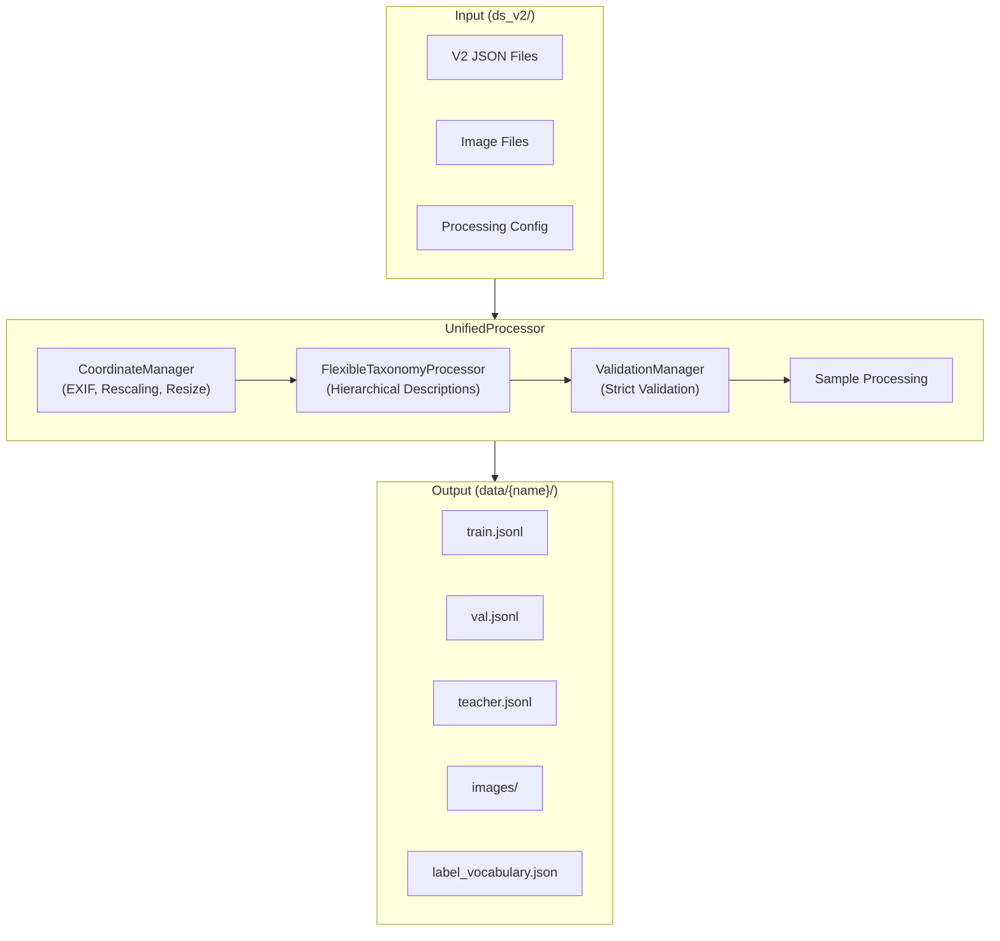
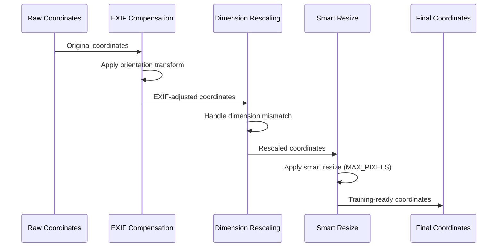
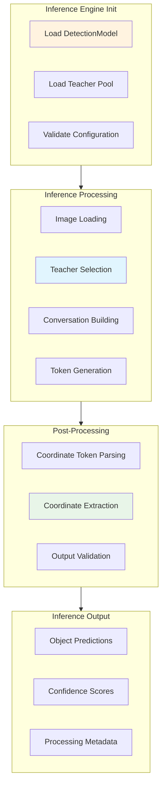

# System Architecture Diagrams

Note: Supplementary diagrams. Canonical facts → `AI_ASSISTANT_KB.md` and `../src_new/UNIFIED_DOCUMENTATION.md`.

**Visual representations of the Qwen2.5-VL BBU detection system architecture and data flow**

> **Note**: For high-level overview and component descriptions, see [README.md](README.md). This document focuses on detailed architectural diagrams and technical schematics.

## Production System Architecture

### Component Interaction Diagram

### Data Flow Architecture

## Training Pipeline Architecture

### 8-Step Training Flow

### Coordinate Token System Architecture

## Loss Computation Architecture

### Dual-Loss System Diagram

## Distributed Training Architecture

### NCCL Timeout Resolution

**Key Improvements**:
- **Local Loss Aggregation**: Eliminates NCCL timeout issues (100% success rate)
- **Rank-Aware Logging**: Prevents cross-rank log spam
- **Unified Checkpoint Management**: SafeTensors format with best-copy creation

## Data Conversion Pipeline Architecture

### Unified Processing Flow

### Coordinate Transformation Pipeline

## Inference Pipeline Architecture

### Production Inference Flow

**Key Features**:
- **Teacher-Guided Inference**: Replicates training pipeline teacher assignment
- **Training-Compatible Processing**: Exact data preparation pipeline match
- **Robust Error Handling**: Comprehensive validation with detailed diagnostics
- **Batch Processing**: Configurable batch sizes with automatic adjustment for teacher mode