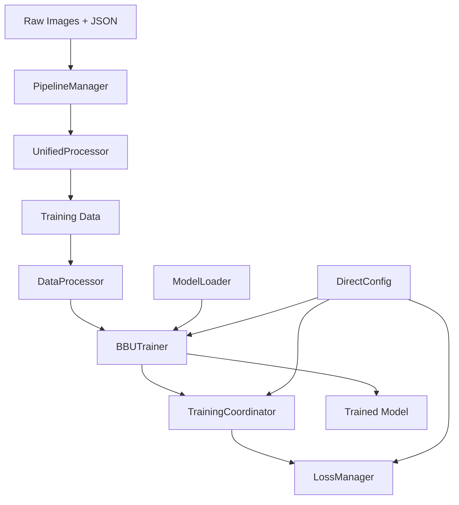

# BBU Detection System Architecture

**Comprehensive overview of the 2025 modular architecture**

## System Overview

### What This System Does
The BBU Detection System is a specialized vision-language model that:
- **Detects BBU equipment** in images with multi-geometry support (bbox, square, line)
- **Generates natural language descriptions** with hierarchical Chinese attributes
- **Uses coordinate tokens** embedded in text sequences (not traditional regression heads)
- **Supports object-oriented training** with flexible equipment type combinations
- **Processes Chinese BBU annotations** with automatic hierarchical formatting

### Key Innovation: Coordinate Token System
Instead of traditional regression heads, coordinates are embedded directly in text:

```
Traditional: "BBU设备" + regression head → [10, 20, 100, 200]
Our System: "BBU设备: <|box_start|><coord_10><coord_20><coord_100><coord_200><|box_end|>"
```

## Architecture Evolution (2025 Refactoring)

### Before (Legacy)
```
Single 2100+ line trainer class
149+ configuration parameters in one file
Scattered detection components
Difficult to debug and extend
```

### After (Current Modular Architecture)
```
src/
├── training/          # Modular training components
├── models/           # Model management and loading
├── core/             # Central factories and processors
├── config/           # Configuration management
└── utils/            # Utilities and token management
```

## Core Design Principles

1. **Separation of Concerns**: Each module has a single responsibility
2. **Factory Pattern**: Centralized component creation with validation
3. **Configuration-Driven**: Behavior controlled through DirectConfig
4. **Fail-Fast Validation**: Errors caught early with clear messages
5. **Training-Inference Consistency**: Same model loading for both modes

## High-Level Data Flow



**Flow Details:**
1. **Data Processing**: 5-stage pipeline converts raw BBU annotations
2. **Coordinate Conversion**: Transform coordinates to special tokens
3. **Model Training**: Enhanced HuggingFace trainer with multi-task learning
4. **Loss Computation**: LLM loss + coordinate L1 loss with teacher-student splitting
5. **Parameter Updates**: Unified training with coordinate token support

## Modular Component Architecture

### Training System (`src/training/`)

| Component | File | Purpose | Key Features |
|-----------|------|---------|--------------|
| **BBUTrainer** | `trainer.py` | Enhanced HuggingFace Trainer | Multi-component loss logging, teacher-student support |
| **TrainingCoordinator** | `training_coordinator.py` | Training orchestration | Multi-task coordination, state management |
| **LossManager** | `loss_manager.py` | Multi-task loss computation | LLM + coordinate L1 loss, span-based teacher-student splitting |
| **ParameterManager** | `parameter_manager.py` | Learning rate management | Differential rates for coordinate tokens |
| **TrainerFactory** | `trainer_factory.py` | Trainer creation | Factory pattern with automatic component setup |

### Model System (`src/models/`)

| Component | File | Purpose | Key Features |
|-----------|------|---------|--------------|
| **ModelLoader** | `model_loader.py` | Unified model loading | Training-inference consistency, automatic patches |
| **Qwen25VLWithDetection** | `wrapper.py` | Main model wrapper | Extended vocabulary, coordinate token support |
| **Patches** | `patches.py` | Model enhancements | mRoPE fix, Flash Attention 2, memory optimization |

### Core System (`src/core/`)

| Component | File | Purpose | Key Features |
|-----------|------|---------|--------------|
| **DataProcessor** | `data_processor.py` | Unified data pipeline | Dataset creation, collator setup, teacher pool integration |
| **CheckpointManager** | `checkpoint_manager.py` | Model saving/loading | Checkpoint management, recovery utilities |

### Configuration System (`src/config/`)

| Component | File | Purpose | Key Features |
|-----------|------|---------|--------------|
| **GlobalConfig** | `global_config.py` | Configuration management | DirectConfig system, unified access, validation |

### Utilities (`src/utils/`)

| Component | File | Purpose | Key Features |
|-----------|------|---------|--------------|
| **SimpleTokenManager** | `simple_token_manager.py` | Token management | Lightweight token addition, ms-swift inspired |
| **CoordinateTokenManager** | `coordinate_token_manager.py` | Legacy coordinate tokens | Backward compatibility (deprecated) |
| **ResponseParser** | `response_parser.py` | Response parsing | Robust parsing of model outputs |
| **Prompt** | `prompt.py` | Prompt engineering | BBU-specific prompt templates |

## Data Processing Pipeline (`data_conversion/`)

### 5-Stage Processing System

| Stage | Component | Purpose | Key Features |
|-------|-----------|---------|--------------|
| **Stage 1** | `clean_raw_json.py` | JSON cleaning | Remove metadata, preserve essential structure |
| **Stage 2** | Token mapping | Language conversion | Chinese-to-English mapping (optional) |
| **Stage 3** | `unified_processor.py` | Core processing | Multi-geometry support, object filtering |
| **Stage 4** | Validation | Quality assurance | Format validation, coordinate checking |
| **Stage 5** | Summary | Reporting | Processing statistics, quality metrics |

### Object-Oriented Training Support

| Object Type | Chinese Label | Geometry | Training Use |
|-------------|---------------|----------|--------------|
| `bbu` | BBU设备 | `bbox_2d`/`square` | Equipment detection |
| `bbu_shield` | 挡风板 | `bbox_2d`/`square` | Shield detection |
| `connect_point` | 螺丝、光纤插头 | `bbox_2d`/`square` | Hardware detection |
| `label` | 标签 | `bbox_2d`/`square` | Text recognition |
| `fiber` | 光纤 | `line` | Cable routing |
| `wire` | 电线 | `line` | Wire management |

## Coordinate Token Innovation

### Token System Architecture
1. **Extended Vocabulary**: Original vocab + coordinate tokens (0-2047)
2. **Multi-Geometry Support**: bbox_2d, square (quadrilateral), line (multi-point)
3. **Semantic Wrapping**: Different tokens for different geometry types
4. **Hierarchical Descriptions**: Chinese format with comma/slash hierarchy

### Token Examples
```
# Bbox geometry
<|box_start|><coord_264><coord_144><coord_326><coord_201><|box_end|> 
<|object_ref_start|>螺丝、光纤插头/BBU安装螺丝,显示完整,符合要求<|object_ref_end|>

# Square geometry  
<|square_start|><coord_150><coord_10><coord_211><coord_35><coord_218><coord_16><coord_166><coord_0><|square_end|>
<|object_ref_start|>标签/5G-BBU<|object_ref_end|>

# Line geometry
<|line_start|><coord_579><coord_1385><coord_679><coord_1451><coord_764><coord_1444><|line_end|>
<|object_ref_start|>光纤/有保护措施<|object_ref_end|>
```

## Loss System Architecture

### Multi-Component Loss Computation
```python
# LossManager computes two main components:
total_loss = (
    llm_loss +           # Standard language modeling loss
    coordinate_l1_loss   # L1 loss for coordinate accuracy
)

# Teacher-Student Differentiation (span-based):
teacher_loss = llm_loss * teacher_ratio          # Teachers: LLM loss only
student_loss = (llm_loss + coordinate_l1_loss) * student_ratio  # Students: both losses
```

### Teacher-Student Learning
- **Teachers**: High-quality demonstrations from teacher pool (LLM loss only)
- **Students**: Model's own predictions (LLM + coordinate loss)
- **Span-Based Splitting**: Proportional loss allocation based on token counts
- **Dynamic Ratios**: Configurable teacher/student balance

## Performance Characteristics

### Memory Usage
- **Base Model**: ~13.5GB (Qwen2.5-VL-7B)
- **With Coordinate Tokens**: ~13.7GB 
- **Overhead**: ~200MB (1.5% increase)

### Training Optimizations
- **Differential Learning Rates**: Higher rates for coordinate tokens
- **Gradient Checkpointing**: Memory optimization
- **Flash Attention 2**: Efficient attention computation
- **Packed Sequence Collation**: Efficient batching

## Component Interaction Patterns

### Training Flow
```
scripts/train.py
    ↓
training/trainer_factory.py → training/trainer.py
    ↓                              ↓
training/training_coordinator.py ←→ training/loss_manager.py
    ↓                              ↓
models/wrapper.py              utils/simple_token_manager.py
    ↓
models/model_loader.py + models/patches.py
```

### Data Flow
```
Raw JSONL → chat_processor.py → data.py → core/data_processor.py
    ↓              ↓                ↓             ↓
BBU Format → Chat Format → Collated Batches → Training Ready
```

### Configuration Flow
```
YAML Config → config/global_config.py → DirectConfig instance
    ↓                    ↓                      ↓
Parameter validation → Type checking → Global access
```

## Error Handling Philosophy

### Fail-Fast Validation
- **No Silent Failures**: All errors exposed immediately
- **Clear Error Messages**: Detailed context for debugging
- **Component Attribution**: Identify which component failed
- **Data Validation**: Strict format checking with helpful messages

### Example Error Handling
```python
# Old approach (bad)
try:
    process_coordinates(coords)
except:
    coords = default_coords  # Silent failure

# New approach (good) 
if not validate_coordinates(coords):
    raise ValueError(f"Invalid coordinates {coords} in object {obj}. Check data preprocessing.")
```

## Extension Points

### Adding New Components
1. Place in appropriate domain folder (`training/`, `models/`, `core/`)
2. Use factory pattern for complex object creation
3. Add comprehensive logging and error handling
4. Follow single responsibility principle

### Adding New Geometry Types
1. Add tokens to `simple_token_manager.py`
2. Update `coordinate_manager.py` for transformations
3. Extend `chat_processor.py` for formatting
4. Add validation in data pipeline

### Adding New Object Types
1. Update `object_types` in data conversion config
2. Add to `flexible_taxonomy_processor.py`
3. Update training data filtering
4. Add evaluation metrics

---

**Next Steps:**
- **Quick Start**: [docs/quick-start/README.md](quick-start/README.md)
- **Component Details**: [docs/components/](components/)
- **Workflows**: [docs/workflows/](workflows/)
- **API Reference**: [docs/reference/api.md](reference/api.md)
