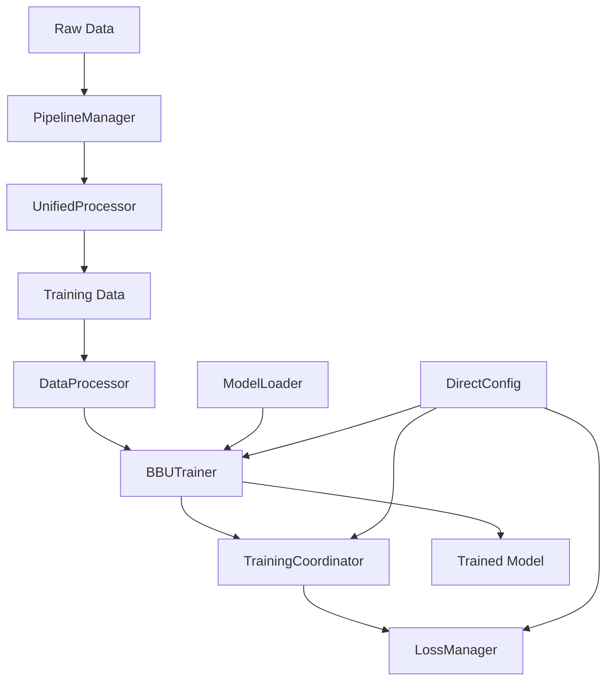

# BBU Detection System - Mental Model

**The single source of truth for understanding this codebase**

## What This System Does (30 seconds)

The BBU Detection System is a specialized vision-language model that:
- **Takes images of BBU equipment + JSON annotations**
- **Trains Qwen2.5-VL to detect equipment and generate descriptions**
- **Uses coordinate tokens embedded in text** (not traditional regression heads)
- **Supports 6 equipment types** with multi-geometry (bbox/square/line)
- **Processes Chinese BBU annotations** with hierarchical descriptions

**Key Innovation**: Instead of separate detection heads, coordinates are part of the text sequence:
```
Traditional: Image → CNN → Regression Head → [x1,y1,x2,y2]
Our System: Image → VLM → Text → "BBU设备: <coord_10><coord_20><coord_100><coord_200>"
```

## Data Flow (5 Main Steps)

```
Raw Images/JSON → PipelineManager → UnifiedProcessor → Training Data → BBUTrainer → Trained Model
```

### Detailed Flow:
1. **Raw Data**: Vendor JSON files + images with BBU equipment annotations
2. **PipelineManager**: 5-stage processing pipeline (clean, map, process, validate, summarize)
3. **UnifiedProcessor**: Multi-geometry processing, coordinate transformation, object filtering
4. **Training Data**: JSONL files with coordinate tokens embedded in conversations
5. **BBUTrainer**: Enhanced HuggingFace trainer with multi-component loss tracking

## Code Organization (4 Main Areas)

### `src/training/` - How We Train
- **BBUTrainer**: Enhanced HuggingFace trainer with coordinate token support
- **TrainingCoordinator**: Orchestrates multi-task training
- **LossManager**: Computes LLM + coordinate L1 losses
- **TrainerFactory**: Creates trainers with all components

### `src/models/` - What We Train  
- **ModelLoader**: Unified model loading for training/inference
- **Qwen25VLWithDetection**: Main model wrapper with coordinate tokens
- **Patches**: mRoPE fix, Flash Attention 2, memory optimization

### `src/core/` - Data Processing
- **DataProcessor**: Creates datasets and collators
- **CheckpointManager**: Model saving/loading utilities

### `data_conversion/` - Raw Data → Training Data
- **PipelineManager**: 5-stage processing orchestrator
- **UnifiedProcessor**: Core processing engine
- **CoordinateManager**: Multi-geometry coordinate transformations
- **FlexibleTaxonomyProcessor**: Chinese annotation processing

## Key Concepts

### Object-Oriented Training
Train on specific equipment types or combinations:
```bash
OBJECT_TYPES="bbu"           # Equipment detection only
OBJECT_TYPES="label"         # Text recognition only  
OBJECT_TYPES="fiber wire"    # Cable system model
OBJECT_TYPES="full"          # All object types
```

### Multi-Geometry Support
- **bbox_2d**: `[x1, y1, x2, y2]` - Standard rectangular boxes
- **square**: `[x1, y1, x2, y2, x3, y3, x4, y4]` - Rotated quadrilaterals  
- **line**: `[x1, y1, x2, y2, ..., xN, yN]` - Multi-point lines (cables)

### Coordinate Token System
Coordinates are embedded as special tokens in text:
```
<|box_start|><coord_264><coord_144><coord_326><coord_201><|box_end|> 
<|object_ref_start|>螺丝、光纤插头/BBU安装螺丝,显示完整,符合要求<|object_ref_end|>
```

### Teacher-Student Learning
- **Teachers**: High-quality demonstrations from teacher pool
- **Students**: Model's own predictions during training
- **Loss Splitting**: Teachers get LLM loss only, students get LLM + coordinate loss

## Component Interaction



## Entry Points (How to Start)

### I want to train a model
```bash
python scripts/train.py --config configs/base_flat_v2.yaml
```

### I want to process new data  
```bash
bash data_conversion/convert_dataset.sh
```

### I want to run inference
```bash
python src/inference.py --model_path /path/to/model
```

### I want to understand the architecture
```bash
# Read this file first, then:
docs/ARCHITECTURE.md        # Complete system architecture
docs/components/            # Individual component details
```

## Common Failure Points

1. **Module Import Errors**: Run from project root, check PYTHONPATH
2. **Config Issues**: Parameter names in DirectConfig (src/config/global_config.py)
3. **Data Pipeline Failures**: Check data_conversion/ logs
4. **Training Coordinator Setup**: Verify model/tokenizer initialization
5. **Memory Issues**: Reduce batch size in config

## Quick Health Checks

```bash
# 1. Can I import core components?
python -c "from src.training.trainer import BBUTrainer; print('✅ Training system OK')"

# 2. Is data pipeline working?
ls data/ | grep -E "(train|val).jsonl" && echo "✅ Data pipeline OK"

# 3. Is config valid?
python -c "from src.config import get_config; c=get_config(); print('✅ Config OK')"

# 4. Can I load model?
python -c "from src.models.model_loader import load_model_and_processor_unified; print('✅ Model loading OK')"
```

---

**Next Steps**: 
- New to the project? → Read `docs/quick-start/README.md`
- Want to understand architecture? → Read `docs/ARCHITECTURE.md`
- Need to solve a problem? → Check `docs/reference/troubleshooting.md`
- Want to extend the system? → Read `docs/components/`
