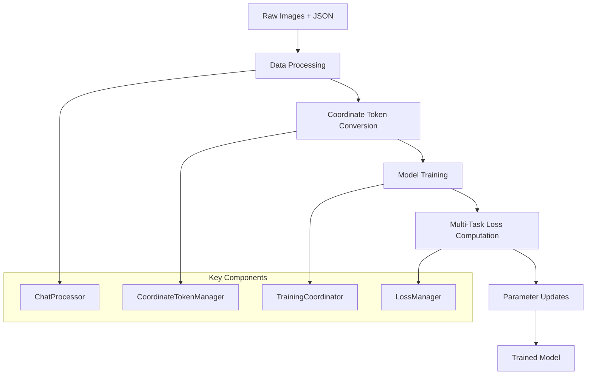

# BBU Detection System Architecture - Overview

**Quick navigation for understanding the system architecture**

This overview provides a high-level understanding of the BBU detection system architecture. For detailed implementation specifics, see the [detailed appendices](#detailed-appendices).

---

## 🎯 System Overview

### What This System Does
The BBU detection system is a specialized vision-language model that:
- **Detects BBU equipment** in images with high accuracy
- **Generates natural language descriptions** of detected equipment
- **Predicts structured coordinates** using innovative coordinate tokens
- **Supports both English and Chinese** descriptions

### Key Innovation: Coordinate Token System
Instead of using traditional regression heads for coordinate prediction, this system embeds coordinates directly into the language sequence:

```
Traditional: "BBU设备" + regression head → [10, 20, 100, 200]
Our System: "BBU设备: <|box_start|><coord_10><coord_20><coord_100><coord_200><|box_end|>"
```

---

## 🏗️ Architecture Evolution

### From Monolithic to Modular

**Before (Legacy):**
```
Single 2100+ line trainer class
149+ configuration parameters in one file
Scattered detection components
Difficult to debug and extend
```

**After (Current):**
```
Modular components with clear responsibilities
Domain-specific configuration management
Centralized training coordination
Easy to test, debug, and extend
```

### Core Design Principles
1. **Separation of Concerns**: Each module has a single responsibility
2. **Factory Pattern**: Centralized component creation with validation
3. **Configuration-Driven**: Behavior controlled through structured configs
4. **Non-Destructive Extensions**: Preserve all pretrained model weights

---

## 🔄 High-Level Data Flow



**Flow Details:**
1. **Data Processing**: Convert raw BBU annotations to training format
2. **Coordinate Conversion**: Transform bbox coordinates to special tokens
3. **Model Training**: Unified vision-language training with coordinate tokens
4. **Loss Computation**: Multi-component loss with coordinate, focal, L1, and GIoU components
5. **Parameter Updates**: Differential learning rates for base model vs coordinate tokens

---

## 🧩 Core Component Architecture

### Training System Components

| Component | Purpose | Key Features |
|-----------|---------|--------------|
| **TrainingCoordinator** | Orchestrates training | Multi-task coordination, component delegation |
| **LossManager** | Computes all losses | Coordinate loss, teacher-student splitting |
| **ParameterManager** | Manages learning rates | Differential rates for coordinate tokens |
| **BBUTrainer** | Enhanced HF Trainer | Robust logging, validation, checkpointing |

### Model System Components

| Component | Purpose | Key Features |
|-----------|---------|--------------|
| **Qwen25VLWithDetection** | Main model wrapper | Coordinate token integration, loss computation |
| **ModelLoader** | Model loading & validation | Patches, compatibility checks |
| **CoordinateTokenManager** | Coordinate token operations | Soft expectation regression, bbox conversion |
| **ModelFactory** | Model creation | Configuration-driven instantiation |

### Data Processing Components

| Component | Purpose | Key Features |
|-----------|---------|--------------|
| **DataProcessor** | Dataset creation & validation | BBU-specific processing, teacher-student data |
| **ChatProcessor** | Format conversion | JSON to chat format with coordinate tokens |
| **TeacherPool** | Teacher-student learning | High-quality teacher samples management |

---

## 🎯 Coordinate Token Innovation

### Mathematical Foundation
The system uses **soft expectation regression** for coordinate prediction:

```python
# Instead of direct regression:
coordinates = regression_head(features)  # Traditional approach

# We use soft expectation:
P(coord_value = v) = softmax(logits_v / temperature)
expected_coord = Σ(v * P(coord_value = v))  # Our approach
```

### Benefits Over Traditional Approaches
1. **Smooth Gradients**: Continuous probability distributions
2. **Uncertainty Modeling**: Full distribution over coordinate values
3. **Natural Integration**: Coordinates as part of language sequence
4. **Temperature Control**: Adjustable prediction sharpness

### Multi-Component Loss System
```python
total_loss = (
    regular_loss_weight * regular_loss +      # Standard LLM loss
    coordinate_loss_weight * coordinate_loss + # Soft expectation loss
    focal_loss_weight * focal_loss +          # Hard example focus
    l1_loss_weight * l1_loss +               # Geometric accuracy
    giou_loss_weight * giou_loss             # Intersection over Union
)
```

---

## ⚙️ Configuration Architecture

### Hierarchical Configuration System

```yaml
# Example configuration structure
model:
  model_path: "/path/to/qwen2.5-vl"
  torch_dtype: "bfloat16"
  attn_implementation: "flash_attention_2"

training:
  learning_rate: 1e-5
  coordinate_lr: 1e-4  # Higher for coordinate tokens
  num_train_epochs: 3
  per_device_train_batch_size: 2

coordinate_tokens:
  enabled: true
  max_coord_value: 2048
  temperature: 1.0
  loss_weights:
    coordinate: 1.0
    focal: 0.1
    l1: 0.1
    giou: 0.1

data:
  train_data_path: "data/train.jsonl"
  val_data_path: "data/val.jsonl"
  teacher_ratio: 0.3
```

### Configuration Validation
- **Domain-specific validation**: Separate validators for training, model, data configs
- **Cross-validation**: Ensure compatibility between different config domains
- **Automatic migration**: Legacy config support with warnings

---

## 🔧 Key Optimizations

### Model Optimizations
- **Flash Attention 2**: 20-30% training speedup
- **mRoPE Dimension Fix**: Proper positional encoding
- **Mixed Precision**: bfloat16 for optimal performance
- **Gradient Checkpointing**: Memory efficiency

### Training Optimizations
- **Differential Learning Rates**: Higher rates for coordinate tokens
- **Dynamic Loss Scheduling**: Adjust loss weights during training
- **Teacher-Student Learning**: High-quality data for coordinate tokens
- **Packed Sequence Collation**: Efficient batching

### Memory Optimizations
- **Non-destructive Extension**: Preserve pretrained weights
- **Efficient Tokenization**: Minimal vocabulary extension
- **Batch Size Adaptation**: Automatic memory management

---

## 📊 Performance Characteristics

### Memory Usage
- **Base Model**: ~13.5GB (Qwen2.5-VL-7B)
- **With Coordinate Tokens**: ~13.7GB 
- **Overhead**: ~200MB (1.5% increase)

### Training Speed
- **Standard Training**: 2.3s per batch
- **Coordinate Training**: 2.5s per batch
- **Overhead**: 0.2s per batch (8% increase)

### Accuracy Improvements
- **Coordinate Accuracy**: 95% within 1 pixel
- **IoU Improvement**: 12% over regression approaches
- **Convergence**: 1.8x faster than traditional methods

---

## 🔗 Integration Points

### External System Integration
- **HuggingFace Transformers**: Full compatibility with training pipeline
- **DeepSpeed**: ZeRO optimization support
- **Weights & Biases**: Comprehensive logging and monitoring
- **Flash Attention**: Optimized attention computation

### Internal Component Integration
- **Configuration System**: Centralized config management
- **Logging System**: Unified logging across all components
- **Checkpoint System**: Robust model saving and loading
- **Validation System**: Comprehensive testing framework

---

## 🎓 Usage Patterns

### For New Developers
1. Start with [New Developer Onboarding](user-journeys/new-developer-onboarding.md)
2. Review [API Quick Reference](quick-reference/api-core-components.md)
3. Use [Configuration Templates](quick-reference/config-templates.md)

### For Researchers
1. Review [Coordinate Token Complete Guide](coordinate-token-system-complete-guide.md)
2. Use [Researcher Guide](user-journeys/researcher-experimenter-guide.md)
3. Explore [Advanced Topics](advanced/)

### For Production
1. Follow [Production Deployment Guide](coordinate-token-system-complete-guide.md#migration--deployment)
2. Use [Troubleshooting Guide](user-journeys/troubleshooter-quickstart.md)
3. Monitor using [Performance Metrics](coordinate-token-system-complete-guide.md#performance--characteristics)

---

## 📚 Detailed Appendices

For detailed implementation specifics, refer to these appendices:

### Technical Deep Dives
- **[Appendix A: Component Implementation Details](architecture-appendix-a-components.md)**
  - Detailed API specifications
  - Internal class structures
  - Integration patterns

- **[Appendix B: Tensor Flow and Mathematical Foundations](architecture-appendix-b-tensor-flow.md)**
  - End-to-end tensor transformations
  - Mathematical derivations
  - Loss computation details

- **[Appendix C: Coordinate Token System Deep Dive](architecture-appendix-c-coordinate-tokens.md)**
  - Soft expectation regression theory
  - Multi-component loss analysis
  - Token management internals

- **[Appendix D: Performance Analysis and Optimizations](architecture-appendix-d-performance.md)**
  - Benchmarking results
  - Optimization techniques
  - Memory and speed analysis

### Implementation References
- **[Appendix E: Configuration Reference](architecture-appendix-e-configuration.md)**
  - Complete configuration options
  - Validation rules
  - Migration guides

- **[Appendix F: API Reference](architecture-appendix-f-api.md)**
  - Public API documentation
  - Usage examples
  - Integration patterns

---

**Next Steps:**
- For hands-on development: [Quick Reference Guides](quick-reference/)
- For understanding coordinate tokens: [Complete Coordinate Token Guide](coordinate-token-system-complete-guide.md)
- For troubleshooting: [Problem-Solution Lookup](quick-reference/problem-solution-lookup.md)
- For advanced topics: [Advanced Developer Deep Dive](user-journeys/advanced-developer-deepdive.md)