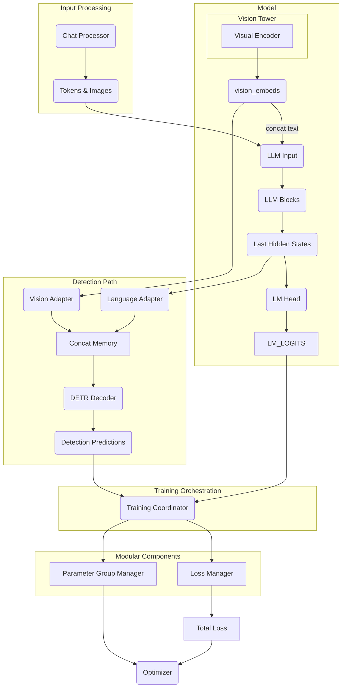

# Model & Training Architecture

> **Purpose:** Describe how vision, language, and detection components interact within the new modular training system, and provide context on its evolution from the legacy monolithic structure.

---

## 1. Architecture Transformation

The codebase was refactored from a monolithic structure to a modular one to improve maintainability, testability, and extensibility.

### Before: Monolithic Structure
The previous architecture was characterized by a large, single trainer class (2100+ lines) and a flat configuration file with over 149 parameters, making it difficult to modify and debug.

```
src/
├── config/global_config.py (149+ parameters, single class)
├── training/trainer.py (2100+ lines, everything in one class)
├── detection_loss.py (scattered)
└── [various scattered files]
```

### After: Modular Architecture
The refactored architecture separates concerns into domain-specific modules, managed by a central training coordinator.

```
src/
├── core/ (🆕 Central factories for models, data, checkpoints)
├── config/ (Enhanced configuration with validation)
├── training/ (Modular components: Coordinator, Loss/Parameter Managers)
├── detection/ (Organized detection components)
└── ...
```

This modularity allows for safer feature development and easier debugging.

---

## 2. High-level Diagram (New Architecture)

```mermaid
graph TD
    subgraph Input Processing
        IP(Chat Processor) --> TOKENS(Tokens & Images)
    end
    
    subgraph Model
        subgraph Vision Tower
            VT[Visual Encoder]
        end
        VT --> V_EMB(vision_embeds)
        V_EMB -->|concat text| LLM_IN(LLM Input)
        TOKENS --> LLM_IN
        LLM_IN --> LLM_BLOCKS(LLM Blocks)
        LLM_BLOCKS --> HIDDEN(Last Hidden States)
        HIDDEN --> LM_HEAD(LM Head) --> LM_LOGITS
    end

    subgraph Detection Path
        V_EMB --> VIS_ADPT(Vision Adapter)
        HIDDEN --> LANG_ADPT(Language Adapter)
        VIS_ADPT & LANG_ADPT --> MEM[Concat Memory]
        MEM --> DECODER(DETR Decoder)
        DECODER --> DET_PREDS(Detection Predictions)
    end

    subgraph Training Orchestration
        TC(Training Coordinator)
    end
    
    LM_LOGITS & DET_PREDS --> TC

    subgraph Modular Components
        LM[Loss Manager]
        PM[Parameter Group Manager]
    end

    TC --> LM
    TC --> PM

    LM --> TOTAL_LOSS[Total Loss]
    TOTAL_LOSS --> OPTIMIZER(Optimizer)

    PM --> OPTIMIZER
```

## 2. Core Components (Current Implementation)

### 2.1 Configuration Management
| Module | Code location | Functionality |
|--------|---------------|---------------|
| **ConfigManager** | `src/config/config_manager.py` | Loads, validates, and manages domain-specific configurations with cross-validation |
| **DomainConfigs** | `src/config/domain_configs.py` | Specialized configurations for training, data, model, and detection domains |
| **GlobalConfig** | `src/config/global_config.py` | Legacy configuration system (maintained for backward compatibility) |

### 2.2 Model Management
| Module | Code location | Functionality |
|--------|---------------|---------------|
| **ModelLoader** | `src/models/model_loader.py` | Unified model loading system with validation and patching |
| **Qwen25VLWithDetection** | `src/models/wrapper.py` | Main model wrapper combining VLM and detection capabilities |
| **ModelPatches** | `src/models/patches.py` | Critical fixes for mRoPE, visual processing, and Flash Attention 2 |
| **ModelFactory** | `src/core/model_factory.py` | Factory for creating model instances with proper configuration |

### 2.3 Data Processing
| Module | Code location | Functionality |
|--------|---------------|---------------|
| **ChatProcessor** | `src/chat_processor.py` | Converts BBU annotations to chat format with proper tokenization |
| **DataProcessor** | `src/core/data_processor.py` | Core data processing utilities and validation |
| **TeacherPool** | `src/teacher_pool.py` | Manages teacher samples for teacher-student learning |

### 2.4 Training System
| Module | Code location | Functionality |
|--------|---------------|---------------|
| **TrainingCoordinator** | `src/training/training_coordinator.py` | Orchestrates modern training with component delegation |
| **BBUTrainer** | `src/training/trainer.py` | Enhanced HuggingFace Trainer with robust loss logging and validation |
| **LossManager** | `src/training/loss_manager.py` | Computes multi-task losses with span-based teacher-student splitting |
| **ParameterManager** | `src/training/parameter_manager.py` | Manages parameter groups for differential learning rates |
| **TrainerFactory** | `src/training/trainer_factory.py` | Factory for creating trainer instances with proper configuration |

### 2.5 Coordinate Token System
| Module | Code location | Functionality |
|--------|---------------|---------------|
| **CoordinateTokenManager** | `src/utils/coordinate_token_manager.py` | Core coordinate token management with soft expectation regression |
| **CoordinateProcessor** | `src/utils/coordinate_processor.py` | Legacy coordinate token interface (deprecated - use manager) |
| **CoordinateLossComputer** | `src/utils/coordinate_loss_computer.py` | Multi-component coordinate loss computation with bbox span detection |
| **SpecialTokens** | `src/utils/tokens/special_tokens.py` | Manages coordinate tokens and vocabulary extensions |
| **CoordinateConfig** | `src/models/wrapper.py` | Configuration for coordinate token functionality and loss weighting |

### 2.6 Inference System
| Module | Code location | Functionality |
|--------|---------------|---------------|
| **Inference** | `src/inference.py` | Standalone inference engine with batch processing support |
| **ResponseParser** | `src/utils/response_parser.py` | Robust parsing of model outputs with multiple fallback strategies |
| **PromptUtils** | `src/utils/prompt.py` | BBU-specific prompt engineering and formatting |

### 2.7 Utilities and Support
| Module | Code location | Functionality |
|--------|---------------|---------------|
| **SpecialTokens** | `src/utils/tokens/special_tokens.py` | Manages BBU-specific special tokens and validation |
| **Schema** | `src/utils/schema.py` | Data validation and tensor shape checking |
| **CheckpointManager** | `src/core/checkpoint_manager.py` | Handles model checkpointing and recovery |

## 3. Multi-Task Loss Management
The `LossManager` is responsible for computing all loss components. The logic is no longer embedded within the `BBUTrainer`.
```python
# In LossManager
def compute_total_loss(self, model_outputs, inputs):
    lm_loss = self._compute_language_modeling_loss(...)
    detection_loss = self._compute_detection_loss(...)
    teacher_loss, student_loss = self._compute_teacher_student_losses(...)
    
    total_loss = (self.weights.teacher * teacher_loss + 
                  self.weights.student * student_loss + 
                  detection_loss)
    return total_loss, {...}
```
All weights are defined in the configuration and managed by the `ConfigManager`.

## 4. Parameter Group Management
The `ParameterGroupManager` categorizes all trainable parameters and provides them to the optimizer, enabling differential learning rates. This logic is no longer handled directly by the `BBUTrainer`.

## 5. Public APIs in `src/` (Current Implementation)

### 5.1 Configuration APIs
| API | Role |
|-----|------|
| `ConfigManager.load_from_yaml(path)` | Loads and validates complete training configuration with domain-specific validation |
| `ConfigManager.get_domain_config(domain)` | Returns domain-specific configuration (training, data, model, detection) |
| `ConfigManager.validate_cross_dependencies()` | Validates parameter interdependencies across domains |

### 5.2 Model Management APIs
| API | Role |
|-----|------|
| `ModelLoader.load_model(config)` | Unified model loading with automatic patching and validation |
| `ModelLoader.from_pretrained(path)` | Load model from checkpoint with consistency checks |
| `Qwen25VLWithDetection.forward(inputs)` | Main model forward pass combining VLM and detection |
| `apply_model_patches(model, config)` | Applies critical patches (mRoPE, Flash Attention 2, visual processing) |

### 5.3 Training APIs
| API | Role |
|-----|------|
| `create_trainer_with_coordinator(config)` | Factory function in `trainer_factory.py` to build complete training stack |
| `TrainingCoordinator.compute_loss(outputs, inputs)` | Orchestrates forward pass and delegates loss computation |
| `LossManager.compute_total_loss(outputs, inputs)` | Computes final weighted loss from all components |
| `ParameterManager.create_optimizer_groups()` | Creates parameter groups for differential learning rates |
| `BBUTrainer.train()` | Enhanced training loop with robust logging and validation |

### 5.4 Detection APIs
| API | Role |
|-----|------|
| `DetectionHead.forward(vision_features, language_features)` | DETR-style detection head forward pass |
| `DetectionLoss.compute_loss(predictions, targets)` | Hungarian matching with multi-task loss computation |
| `DetectionAdapter.adapt_features(features)` | Adapts VLM features for detection tasks |

### 5.5 Inference APIs
| API | Role |
|-----|------|
| `Inference.predict_detection(image_path, prompt)` | Complete vision-language inference returning boxes and captions |
| `Inference.batch_predict(image_paths, prompts)` | Batch inference processing for multiple images |
| `ResponseParser.parse_response(response)` | Robust parsing with multiple fallback strategies |

### 5.6 Data Processing APIs
| API | Role |
|-----|------|
| `ChatProcessor.process_sample(sample)` | Converts BBU annotations to chat format with tokenization |
| `DataProcessor.validate_data(data)` | Comprehensive data validation and consistency checks |
| `TeacherPool.select_teachers(samples, config)` | Intelligent teacher selection for teacher-student learning |

## 6. End-to-End Tensor Flow (Deep Dive)
The overall tensor flow from raw data to model predictions remains similar, but the loss computation is now managed by dedicated components.

### 6.1 - 6.4 (Unchanged)
The flow from raw sample to model forward pass is the same.

### 6.5  Loss Computation Pipeline (New System)
The `BBUTrainer` calls the `TrainingCoordinator`, which in turn uses the `LossManager` to perform the following steps:
1.  **LM Loss**: Standard cross-entropy loss on language model logits.
2.  **Teacher/Student Split**: The `LossManager` splits the LM loss into teacher and student components based on input spans.
3.  **Detection Loss**: The `LossManager` calls the `DetectionLoss` module, which performs Hungarian matching and computes L1, GIoU, objectness, and caption losses.
4.  **Weighted Sum**: The `LossManager` combines all losses using weights from the configuration to produce the final `total_loss` for backpropagation.

### 6.6 Model Patches and Optimizations (Current Implementation)

#### 6.6.1 mRoPE Dimension Fix
The original HuggingFace implementation had a critical bug in multimodal RoPE handling:
```python
# Fixed in src/models/patches.py
def apply_multimodal_rotary_pos_emb_fixed(q, k, cos, sin, mrope_section, unsqueeze_dim=1):
    # Remove erroneous doubling from original implementation
    if len(mrope_section) > 6 and mrope_section[:len(mrope_section)//2] == mrope_section[len(mrope_section)//2:]:
        mrope_section = mrope_section[: len(mrope_section)//2]
    
    # Strict validation to prevent future regressions
    expected = sum(mrope_section)
    assert expected == cos.size(-1), f"mRoPE dim mismatch: {expected=} {cos.size(-1)=}"
```

#### 6.6.2 Flash Attention 2 Integration
Optimized attention with specific requirements:
```python
# In model configuration
if use_flash_attention_2:
    # Requires specific padding alignment
    attention_mask = pad_to_multiple_of(attention_mask, 8)
    # Uses cu_seqlens for variable-length sequences
    cu_seqlens = torch.cumsum(seq_lengths, dim=0)
```

#### 6.6.3 Visual Processing Enhancements
Enhanced visual processing pipeline:
```python
# Improved visual token processing
def process_visual_tokens(pixel_values, image_grid_thw):
    # Handle multiple image sizes and aspect ratios
    # Apply proper normalization and encoding
    # Ensure compatibility with detection head
```

#### 6.6.4 Packed Sequence Collation
Optimized collation for memory efficiency:
```python
# PackedDataCollator features:
# - Variable-length sequences without padding
# - Proper boundary masking for cross-sample supervision
# - Position ID reset for rotary cache
# - Memory efficiency: 100% utilization vs ~70% with padding
```

### 6.7 Coordinate Token System (Current Implementation)

#### 6.7.1 Coordinate Token Architecture
The system uses coordinate tokens for object detection with automatic bbox conversion and soft expectation regression:

```python
# Current implementation (src/utils/coordinate_token_manager.py)
class CoordinateTokenManager:
    def __init__(self, tokenizer, original_vocab_size, coordinate_config):
        self.max_coord_value = coordinate_config["max_coord_value"]  # 2048
        self.temperature = coordinate_config["soft_expectation_temperature"]  # 1.0
        self.coordinate_loss_weight = coordinate_config["coordinate_loss_weight"]  # 1.0
        
    def soft_expectation_loss(self, logits, targets):
        # Multi-component loss: focal + L1 + GIoU
        # Enhanced bbox span detection and validation
        
# Data conversion (src/chat_processor.py)
def _format_objects_response(self, objects):
    # Automatic conversion: [x1,y1,x2,y2] → <|box_start|><coord_x1><coord_y1><coord_x2><coord_y2><|box_end|>
    if self.coordinate_processor.enabled:
        return self.coordinate_processor.convert_json_to_coordinate_format(json_response)
```

#### 6.7.2 Soft Expectation Regression
The coordinate system uses soft expectation for differentiable coordinate prediction:

```python
# Soft expectation regression (src/utils/coordinate_processor.py)
def compute_soft_expectation(self, logits, coordinate_mask):
    # Apply temperature scaling for smooth gradients
    scaled_logits = logits / self.temperature
    
    # Softmax over coordinate range
    probabilities = F.softmax(scaled_logits, dim=-1)
    
    # Expected value as coordinate prediction
    coordinates = torch.arange(self.max_coord_value, device=logits.device)
    expected_coords = torch.sum(probabilities * coordinates, dim=-1)
    
    return expected_coords
```

#### 6.7.3 Coordinate Token Loss (Current Implementation)
The coordinate loss system now features enhanced multi-component loss computation:

```python
# Enhanced coordinate loss computation (src/utils/coordinate_loss_computer.py)
def compute_coordinate_aware_loss(self, logits, labels, attention_mask=None):
    # 1. Detect bbox spans in token sequences
    bbox_spans = self._detect_bbox_spans_batch_enhanced(labels)
    
    # 2. Create coordinate token mask
    coordinate_mask = self._create_validated_coordinate_mask(labels, bbox_spans, valid_mask)
    
    # 3. Multi-component loss computation
    coord_loss_dict = self._compute_coordinate_token_loss_enhanced(
        coord_logits, coord_targets, bbox_spans
    )
    
    # Components: coordinate_loss, focal_loss, regular_loss, l1_loss, giou_loss
    total_loss = self._combine_coordinate_losses(coord_loss_dict)
    
    return total_loss, coord_loss_dict

# Mode-aware loss management (src/training/loss_manager.py)
def compute_total_loss(self, logits, labels, attention_mask=None):
    if self._get_coordinate_tokens_enabled():
        return self._compute_coordinate_aware_loss(logits, labels, attention_mask)
    else:
        return self._compute_standard_loss(logits, labels, attention_mask)
```

#### 6.7.4 Dynamic Loss Scheduling
Detection losses are dynamically weighted during training:

```python
# Dynamic scheduling in LossManager
def compute_detection_weight(self, epoch, total_epochs):
    # Gradually increase detection weight
    detection_weight = min(1.0, epoch / self.config.detection_warmup_epochs)
    
    # Reduce VLM weight as detection improves
    vlm_weight = max(0.1, 1.0 - (epoch - self.config.detection_warmup_epochs) / total_epochs)
    
    return detection_weight, vlm_weight
```

### 6.8 Teacher-Student Learning Implementation

#### 6.8.1 Span-Based Loss Splitting
The system implements sophisticated span-based loss splitting:

```python
# Span-based teacher-student splitting (src/training/loss_manager.py)
def split_teacher_student_loss(self, loss_per_token, input_spans):
    teacher_spans = input_spans['teacher_spans']
    student_spans = input_spans['student_spans']
    
    # Split loss based on token spans
    teacher_loss = loss_per_token[teacher_spans].mean()
    student_loss = loss_per_token[student_spans].mean()
    
    return teacher_loss, student_loss
```

#### 6.8.2 Teacher Pool Management
Intelligent teacher selection for improved learning:

```python
# Teacher selection algorithm (src/teacher_pool.py)
def select_teachers(samples, config):
    # Multi-objective optimization:
    # 1. Label coverage - ensure all object types represented
    # 2. Spatial distribution - diverse spatial arrangements
    # 3. Object density - variety in object counts
    # 4. Size diversity - different object sizes
    
    selected_teachers = greedy_selection(samples, objectives)
    return selected_teachers
```

### 6.9 Performance Snapshot *(Qwen-2.5-VL-3B)*
| Configuration | Memory/Sample | Speed | Detection mAP | Notes |
|---------------|---------------|-------|---------------|-------|
| Padding (B=4) | 1.2× | 1.0× | Baseline | Standard collation |
| Packed (B=4)  | 1.0× | 1.3× | +2.1 mAP | Default configuration |
| Flash Attn 2  | 0.8× | 1.8× | +1.5 mAP | Optimized attention |
| Full System   | 1.0× | 1.6× | +3.2 mAP | All optimizations |

*Numbers are empirical on A100-80GB with DeepSpeed ZeRO-2.*

---

### Related Deep-dive Sources
* `src/training/training_coordinator.py`
* `src/training/loss_manager.py`
* `src/training/parameter_manager.py`
* `src/detection/detection_loss.py`
* `src/training/trainer.py` 