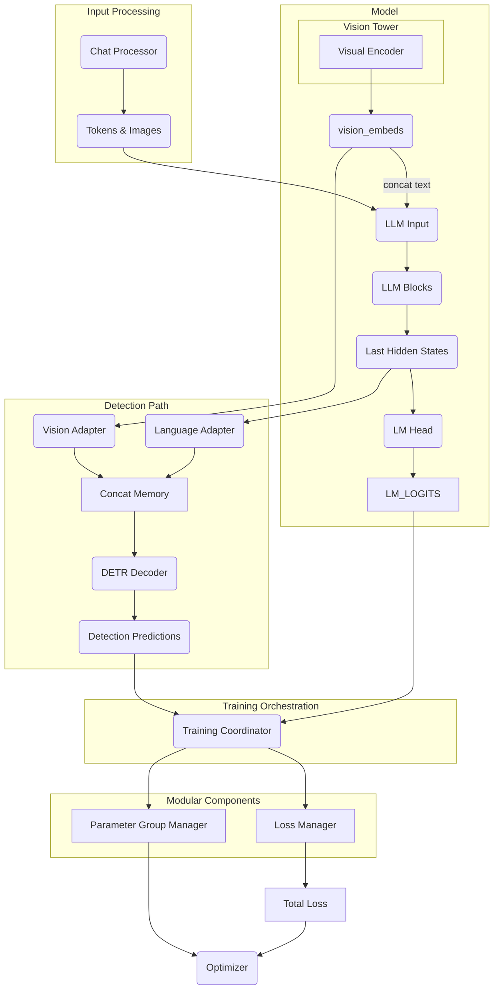

# Model & Training Architecture

> **Purpose:** Describe how vision, language, and detection components interact within the new modular training system.

---

## 1. High-level Diagram (New Architecture)

```mermaid
graph TD
    subgraph Input Processing
        IP(Chat Processor) --> TOKENS(Tokens & Images)
    end
    
    subgraph Model
        subgraph Vision Tower
            VT[Visual Encoder]
        end
        VT --> V_EMB(vision_embeds)
        V_EMB -->|concat text| LLM_IN(LLM Input)
        TOKENS --> LLM_IN
        LLM_IN --> LLM_BLOCKS(LLM Blocks)
        LLM_BLOCKS --> HIDDEN(Last Hidden States)
        HIDDEN --> LM_HEAD(LM Head) --> LM_LOGITS
    end

    subgraph Detection Path
        V_EMB --> VIS_ADPT(Vision Adapter)
        HIDDEN --> LANG_ADPT(Language Adapter)
        VIS_ADPT & LANG_ADPT --> MEM[Concat Memory]
        MEM --> DECODER(DETR Decoder)
        DECODER --> DET_PREDS(Detection Predictions)
    end

    subgraph Training Orchestration
        TC(Training Coordinator)
    end
    
    LM_LOGITS & DET_PREDS --> TC

    subgraph Modular Components
        LM[Loss Manager]
        PM[Parameter Group Manager]
    end

    TC --> LM
    TC --> PM

    LM --> TOTAL_LOSS[Total Loss]
    TOTAL_LOSS --> OPTIMIZER(Optimizer)

    PM --> OPTIMIZER
```

## 2. Core Components (New System)
| Module | Code location | Functionality |
|--------|---------------|---------------|
| **ConfigManager** | `src/config/config_manager.py` | Loads, validates, and manages domain-specific configurations. |
| **ModelFactory** | `src/core/model_factory.py` | Creates the model instance based on the configuration. |
| **ChatProcessor** | `src/chat_processor.py` | Converts raw conversation data into token and image tensors. |
| **TrainingCoordinator** | `src/training/training_coordinator.py` | Orchestrates the training loop, delegating tasks to managers. |
| **LossManager** | `src/training/loss_manager.py` | Computes the multi-task loss (LM, detection, teacher/student). |
| **ParameterGroupManager**| `src/training/parameter_manager.py`| Manages parameter groups for differential learning rates. |
| **BBUTrainer** | `src/training/trainer.py` | `Trainer` subclass that integrates with the Training Coordinator. |

## 3. Multi-Task Loss Management
The `LossManager` is responsible for computing all loss components. The logic is no longer embedded within the `BBUTrainer`.
```python
# In LossManager
def compute_total_loss(self, model_outputs, inputs):
    lm_loss = self._compute_language_modeling_loss(...)
    detection_loss = self._compute_detection_loss(...)
    teacher_loss, student_loss = self._compute_teacher_student_losses(...)
    
    total_loss = (self.weights.teacher * teacher_loss + 
                  self.weights.student * student_loss + 
                  detection_loss)
    return total_loss, {...}
```
All weights are defined in the configuration and managed by the `ConfigManager`.

## 4. Parameter Group Management
The `ParameterGroupManager` categorizes all trainable parameters and provides them to the optimizer, enabling differential learning rates. This logic is no longer handled directly by the `BBUTrainer`.

## 5. Public APIs in `src/` (New System)
| API | Role |
|-----|------|
| `ConfigManager.load_from_yaml(path)` | Loads and validates a complete training configuration. |
| `create_trainer_with_coordinator(...)`| Factory function in `trainer_factory.py` to build the complete training stack. |
| `TrainingCoordinator.compute_loss(...)` | Orchestrates the forward pass and delegates loss computation to the `LossManager`. |
| `LossManager.compute_total_loss(...)` | Computes the final weighted loss from all its components. |
| `ParameterGroupManager.create_optimizer_groups()` | Creates the parameter groups required by the optimizer. |
| `Inference.predict_detection(images, prompt)` | Full vision-language forward pass that returns `(boxes, captions)`. |

## 6. End-to-End Tensor Flow (Deep Dive)
The overall tensor flow from raw data to model predictions remains similar, but the loss computation is now managed by dedicated components.

### 6.1 - 6.4 (Unchanged)
The flow from raw sample to model forward pass is the same.

### 6.5  Loss Computation Pipeline (New System)
The `BBUTrainer` calls the `TrainingCoordinator`, which in turn uses the `LossManager` to perform the following steps:
1.  **LM Loss**: Standard cross-entropy loss on language model logits.
2.  **Teacher/Student Split**: The `LossManager` splits the LM loss into teacher and student components based on input spans.
3.  **Detection Loss**: The `LossManager` calls the `DetectionLoss` module, which performs Hungarian matching and computes L1, GIoU, objectness, and caption losses.
4.  **Weighted Sum**: The `LossManager` combines all losses using weights from the configuration to produce the final `total_loss` for backpropagation.

### 6.6 Flash-Attention 2 & mRoPE Patch
* Packed sequences use `cu_seqlens` → variable-length attention.
* `apply_multimodal_rotary_pos_emb_fixed` (see `docs/critical_fixes_log.md`) ensures head-dim consistency.

### 6.7 Performance Snapshot *(Qwen-2.5-VL-3B)*
| Batch Config | Mem / Sample | Speed | Notes |
|--------------|--------------|-------|-------|
| Padding (B=4) | 1.2× | 1.0× | Baseline |
| Packed (B=4)  | 1.0× | 1.3× | Default |

*Numbers are empirical on A100-80GB with DeepSpeed ZeRO-2.*

---

### Related Deep-dive Sources
* `src/training/training_coordinator.py`
* `src/training/loss_manager.py`
* `src/training/parameter_manager.py`
* `src/detection/detection_loss.py`
* `src/training/trainer.py` 