# Model & Training Architecture

> **Purpose:** Describe how vision, language, and detection components interact during training and inference.

---

## 1. High-level Diagram

```mermaid
graph TD
    subgraph Vision Tower
        VT[Visual Encoder]
    end
    VT --> V_EMB(vision_embeds)
    V_EMB -->|concat text| LLM_IN(LLM Input)
    LLM_IN --> LLM_BLOCKS(LLM Blocks)
    LLM_BLOCKS --> HIDDEN(Last Hidden States)

    subgraph Generation Path
        HIDDEN --> LM_HEAD(LM Head) --> LM_LOSS[🤖 LM Loss]
        LM_LOSS --> TEACHER_SPLIT[Teacher LM Loss]
        LM_LOSS --> STUDENT_SPLIT[Student LM Loss]
    end

    subgraph Detection Path
        V_EMB --> VIS_ADPT(Vision Adapter)
        HIDDEN --> LANG_ADPT(Language Adapter)
        VIS_ADPT & LANG_ADPT --> MEM[Concat Memory]
        MEM --> DECODER(DETR Decoder)
        DECODER --> BBOX[BBox Head]
        DECODER --> OBJ[Objectness Head]
        DECODER --> CAPTION[Caption Decoder]
        BBOX & OBJ & CAPTION --> DET_LOSS[📦 Detection Loss]
    end

    TEACHER_SPLIT & STUDENT_SPLIT & DET_LOSS --> TOTAL[Total Loss]
```


## 2. Core Components
| Module | Code location | Functionality |
|--------|---------------|---------------|
| **Visual Encoder** | `src/models/wrapper.py` | Converts image patches to embeddings. |
| **Vision/Language Adapters** | `src/models/detection_head.py` | Residual MLPs that align visual and textual hidden states. |
| **DETR Decoder & Heads** | `src/models/detection_head.py` | Predict bounding boxes, objectness, and captions. |
| **Chat Processor** | `src/chat_processor.py` | Builds conversation with vision tokens and extracts teacher/student spans. |
| **BBUTrainer** | `src/training/trainer.py` | Custom `Trainer` subclass that computes multi-task loss. |

## 3. Multi-Task Loss
```
 total_loss = (teacher_lm_loss + student_lm_loss)
            + bbox_l1_weight   * bbox_l1_loss
            + bbox_giou_weight * bbox_giou_loss
            + objectness_weight* objectness_loss
            + caption_weight   * caption_loss
```
All weights are configurable in YAML.

## 4. Parameter Groups
The trainer assigns every trainable parameter to one of five groups (`vision`, `merger`, `llm`, `detection`, `adapter`) with independent learning rates.  Unmatched parameters raise `KeyError` at startup (fail-fast principle).

## 5. Public APIs in `src/`
| API | Role |
|-----|------|
| `ChatProcessor.process_sample(raw_sample)` | Converts one teacher-student JSON dict into token & image tensors (`ChatProcessorOutput`). |
| `StandardDataCollator.__call__(instances)` | Pads a batch, builds `attention_mask`, and *preserves* teacher/student spans. |
| `PackedDataCollator.__call__(instances)` | Concatenates sequences; returns `cu_seqlens` and boundary-masked labels for Flash-Attention 2. |
| `BBUTrainer.compute_loss(model, inputs)` | Computes LM + detection loss, then calls `_compute_teacher_student_losses` for span-based split. |
| `detection_loss.hungarian_matcher` | Performs set matching between predicted queries and GT objects (L1 + GIoU cost). |
| `Inference.predict_detection(images, prompt)` | Full vision-language forward pass that returns `(boxes, captions)`.

## 6. End-to-End Tensor Flow (Deep Dive)
Below is a condensed walkthrough of **every tensor** from raw JSONL → loss computation, merged from the former *CLAUDE_TENSOR_ANALYSIS.md*.

### 6.1  Raw Sample → Structured Dict
````jsonc
{
  "teachers": [{"images": ["ds_output/img001.jpeg"],
                 "objects": [{"bbox_2d": [x1,y1,x2,y2],
                               "desc": "螺丝连接点/BBU安装螺丝/连接正确"}]}],
  "student":  {"images": ["ds_output/img002.jpeg"],
                 "objects": [{"bbox_2d": [...], "desc": "..."}]}
}
````
*Created by the conversion pipeline documented in* `docs/data_schema.md`.

---

### 6.2  ChatProcessor → Token & Image Tensors
| Tensor | Shape | Notes |
|--------|-------|-------|
| `input_ids` | `(S,)` or `(B,S)` | Text + vision tokens (`<|vision_start|> <|image_pad|>×N <|vision_end|>`) |
| `pixel_values` | `(T,C,H,W)` | All teacher + student images, **already smart-resized** |
| `image_grid_thw` | `(T,3)` | ViT grid for each image *(temporal, height, width)* |
| `ground_truth_objects` | list[list[GTObject]] | Normalised `[0,1]` boxes + desc strings |

Vision token count is **data-dependent**; see `src/chat_processor.py::_calculate_image_tokens`.

---

### 6.3  Collation Strategies
1. **StandardDataCollator** – padding based (boolean `attention_mask`).
2. **PackedDataCollator** *(default)* – concatenates sequences:
   * `input_ids`: `(1, total_len)`
   * `cu_seqlens`: `(B+1,)` cumulative lengths for Flash-Attention 2.

Packed mode increases throughput ≈ 30 % and prevents *mRoPE* duplication bugs (see `docs/critical_fixes.md`).

---

### 6.4  Model Forward Path
````python
outputs = model(
    input_ids=input_ids,
    pixel_values=pixel_values,
    image_grid_thw=image_grid_thw,
    cu_seqlens=cu_seqlens,           # packed only
)
````
1. **Qwen-2.5-VL backbone** returns `hidden_states` (B,S,D=3584).
2. **Detection wrapper** (`src/models/detection_head.py`) adapts vision + language streams, runs a DETR-style decoder and predicts:
   * `pred_boxes   ∈ [0,1]`  (B,N,4)
   * `pred_objness ∈ ℝ`      (B,N,1)
   * `caption_logits`        (B,N,L,V)

---

### 6.5  Loss Computation Pipeline
````text
 teacher_lm_loss   ↘
 student_lm_loss    ↘
 bbox_l1_loss        ↘  weighted sum → **total_loss**
 bbox_giou_loss      ↗
 objectness_loss    ↗
 caption_loss      ↗
````
All components are calculated in `BBUTrainer.compute_loss()` with Hungarian matching for box ↔ query alignment.

---

### 6.6  Flash-Attention 2 & mRoPE Patch
* Packed sequences use `cu_seqlens` → variable-length attention.
* `apply_multimodal_rotary_pos_emb_fixed` (see `docs/critical_fixes.md`) ensures head-dim consistency (128) under multi-image batching.

---

### 6.7  Performance Snapshot *(Qwen-2.5-VL-3B)*
| Batch Config | Mem / Sample | Speed | Notes |
|--------------|--------------|-------|-------|
| Padding (B=4) | 1.2× | 1.0× | Baseline |
| Packed (B=4)  | 1.0× | 1.3× | Default |

*Numbers are empirical on A100-80GB with DeepSpeed ZeRO-2.*

---

### Related Deep-dive Sources
* `src/chat_processor.py`
* `src/data.py` (collators)
* `src/models/detection_head.py`
* `src/training/trainer.py` 