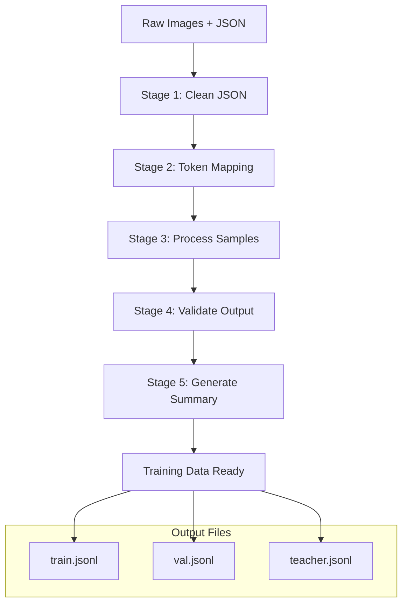

# Data Processing Workflow

**Complete end-to-end workflow: Raw Data → Training Data**

## Overview

This workflow transforms raw BBU annotations and images into training-ready data through a 5-stage processing pipeline. The output is coordinate token conversations ready for vision-language model training.

## Workflow Diagram



## Prerequisites

### Input Data Structure
```
ds_v2/                          # Raw data directory
├── images/                     # Image files
│   ├── QC-20230217-0000279_19621.jpeg
│   ├── QC-20230217-0000280_19622.jpeg
│   └── ...
└── annotations/                # JSON annotation files
    ├── batch_001.json
    ├── batch_002.json
    └── ...
```

### Environment Setup
```bash
# Ensure you're in the project root
cd /data3/Qwen2.5-VL-main

# Verify Python environment
/root/miniconda3/envs/ms/bin/python --version

# Check data conversion components
/root/miniconda3/envs/ms/bin/python -c "
from data_conversion.pipeline_manager import PipelineManager
print('✅ Data conversion system ready')
"
```

## Quick Start (5 minutes)

### Option 1: Shell Script (Recommended)
```bash
# Use the main conversion script
bash data_conversion/convert_dataset.sh

# Monitor progress
tail -f data_conversion/pipeline.log
```

### Option 2: Python Command
```bash
# Direct Python execution
/root/miniconda3/envs/ms/bin/python data_conversion/pipeline_manager.py \
    --input_dir ds_v2 \
    --output_dir data \
    --object_types "bbu label fiber" \
    --resize true \
    --val_ratio 0.1
```

### Verify Output
```bash
# Check output files
ls -la data/
# Expected: train.jsonl, val.jsonl, teacher.jsonl

# Check file sizes
wc -l data/*.jsonl

# Inspect format
head -1 data/train.jsonl | /root/miniconda3/envs/ms/bin/python -m json.tool
```

## Detailed Workflow Steps

### Stage 1: Clean Raw JSON Files

**Purpose**: Remove unnecessary metadata and optimize file size

**Input**: Raw JSON files with vendor metadata
**Output**: Cleaned JSON files with essential structure only

```bash
# Manual execution (if needed)
/root/miniconda3/envs/ms/bin/python data_conversion/clean_raw_json.py \
    ds_v2 ds_v2_clean --lang zh

# What gets preserved:
# - info: Image dimensions (width, height, depth)
# - tagInfo: Task metadata (mode, dataId, taskId, timestamp)
# - version: JSON format version
# - markResult: Complete annotation structure

# What gets removed:
# - Statistical summaries, quality control metadata
# - Administrative fields not needed for training
# - Performance impact: ~85% file size reduction
```

### Stage 2: Apply Token Mapping (Optional)

**Purpose**: Convert Chinese tokens to English equivalents when needed

```bash
# Usually skipped for Chinese-only processing
# Used for bilingual support if needed
```

### Stage 3: Process Samples (Core Processing)

**Purpose**: Transform annotations into coordinate token format

**Components**:
- **UnifiedProcessor**: Core processing engine
- **CoordinateManager**: 3-stage coordinate transformation
- **FlexibleTaxonomyProcessor**: Chinese description processing

```bash
# This stage handles:
# - Multi-geometry processing (bbox, square, line)
# - Object type filtering
# - Coordinate transformation
# - Hierarchical description formatting
```

#### 3-Stage Coordinate Transformation
```python
# Stage 1: EXIF Orientation Compensation
if exif_orientation in [3, 6, 8]:
    coords = apply_orientation_transform(coords, orientation)

# Stage 2: Dimension Mismatch Rescaling
scale_x = image_width / json_width
scale_y = image_height / json_height
coords = apply_dimension_scaling(coords, scale_x, scale_y)

# Stage 3: Smart Resize Scaling
new_size = smart_resize(original_size, factor=28)
coords = apply_smart_resize_scaling(coords, original_size, new_size)
```

### Stage 4: Validate Output

**Purpose**: Ensure data quality and format compliance

```bash
# Validation checks:
# - File existence and format validation
# - Coordinate range checking (0-2047)
# - Sample count verification
# - Geometry consistency validation
```

### Stage 5: Generate Summary Report

**Purpose**: Provide processing statistics and quality metrics

```bash
# Report includes:
# - Processing time and throughput
# - Object type distribution
# - Error summary and recommendations
# - Quality metrics
```

## Object-Oriented Training Configurations

### Equipment Detection Model
```bash
export OBJECT_TYPES="bbu bbu_shield"
bash data_conversion/convert_dataset.sh

# Focuses on:
# - BBU equipment detection
# - Shield detection
# - Equipment-specific attributes
```

### Text Recognition Model
```bash
export OBJECT_TYPES="label"
bash data_conversion/convert_dataset.sh

# Focuses on:
# - Label text recognition
# - Text clarity assessment
# - Label positioning
```

### Cable System Model
```bash
export OBJECT_TYPES="fiber wire"
bash data_conversion/convert_dataset.sh

# Focuses on:
# - Fiber cable routing
# - Wire management
# - Cable protection measures
```

### Complete System Model
```bash
export OBJECT_TYPES="full"
bash data_conversion/convert_dataset.sh

# Includes all object types:
# - bbu, bbu_shield, connect_point
# - label, fiber, wire
```

## Output Format

### Training Data Format (train.jsonl)
```json
{
  "images": ["images/QC-20230217-0000279_19621.jpeg"],
  "conversations": [
    {
      "from": "human",
      "value": "<image>\n请描述图像中的BBU设备及其状态。"
    },
    {
      "from": "gpt", 
      "value": "<|box_start|><coord_264><coord_144><coord_326><coord_201><|box_end|> <|object_ref_start|>螺丝、光纤插头/BBU安装螺丝,显示完整,符合要求<|object_ref_end|>"
    }
  ]
}
```

### Multi-Geometry Examples
```json
// Bbox geometry (rectangular)
"<|box_start|><coord_264><coord_144><coord_326><coord_201><|box_end|> <|object_ref_start|>BBU设备/显示完整<|object_ref_end|>"

// Square geometry (quadrilateral)
"<|square_start|><coord_150><coord_10><coord_211><coord_35><coord_218><coord_16><coord_166><coord_0><|square_end|> <|object_ref_start|>标签/5G-BBU<|object_ref_end|>"

// Line geometry (multi-point)
"<|line_start|><coord_579><coord_1385><coord_679><coord_1451><coord_764><coord_1444><|line_end|> <|object_ref_start|>光纤/有保护措施<|object_ref_end|>"
```

## Advanced Configuration

### Custom Processing Parameters
```python
# Python API for advanced customization
from data_conversion.pipeline_manager import PipelineManager
from data_conversion.config import DataConversionConfig

config = DataConversionConfig(
    input_dir="ds_v2",
    output_dir="data",
    object_types=["bbu", "label"],
    resize=True,
    val_ratio=0.15,
    teacher_ratio=0.1,
    coordinate_range=(0, 2047),
    image_size=(448, 448),
    quality_threshold=0.8
)

manager = PipelineManager(config)
manager.run_pipeline()
```

### Batch Processing
```bash
# Process multiple datasets
for dataset in ds_v2_batch1 ds_v2_batch2 ds_v2_batch3; do
    /root/miniconda3/envs/ms/bin/python data_conversion/pipeline_manager.py \
        --input_dir $dataset \
        --output_dir data_$dataset \
        --object_types "full"
done

# Merge outputs
cat data_*/train.jsonl > data/train_combined.jsonl
cat data_*/val.jsonl > data/val_combined.jsonl
```

## Quality Assurance

### Data Validation Checks
```bash
# Check coordinate ranges
/root/miniconda3/envs/ms/bin/python -c "
import json
with open('data/train.jsonl') as f:
    for line in f:
        sample = json.loads(line)
        # Validate coordinate tokens in conversations
        # Check image file existence
        # Verify format compliance
"

# Check object type distribution
grep -o '<|object_ref_start|>[^<]*<|object_ref_end|>' data/train.jsonl | \
    sort | uniq -c | sort -nr
```

### Performance Metrics
```bash
# Processing speed
echo "Processing speed: $(wc -l < data/train.jsonl) samples in $(grep 'Processing time' data_conversion/pipeline.log | tail -1)"

# File size efficiency
echo "Original size: $(du -sh ds_v2)"
echo "Processed size: $(du -sh data)"
```

## Troubleshooting

### Common Issues

#### Missing Input Data
```bash
# Issue: ds_v2/ directory not found
ls -la ds_v2/ || echo "❌ Raw data directory missing"

# Solution: Verify data location and structure
find . -name "*.json" -path "*/ds_v2/*" | head -5
```

#### Processing Failures
```bash
# Issue: Pipeline stage failures
tail -20 data_conversion/pipeline.log

# Solution: Resume from failed stage
/root/miniconda3/envs/ms/bin/python data_conversion/pipeline_manager.py \
    --resume-from-stage 3
```

#### Invalid Coordinates
```bash
# Issue: Coordinate validation errors
grep -i "coordinate.*error" data_conversion/pipeline.log

# Solution: Check coordinate transformation
/root/miniconda3/envs/ms/bin/python -c "
from data_conversion.coordinate_manager import CoordinateManager
manager = CoordinateManager()
# Debug coordinate transformation
"
```

#### Memory Issues
```bash
# Issue: Out of memory during processing
# Solution: Enable streaming processing
export STREAMING_MODE=true
bash data_conversion/convert_dataset.sh
```

### Health Checks
```bash
# Pre-processing checks
echo "Input data check:"
ls -la ds_v2/ | head -5
find ds_v2/ -name "*.json" | wc -l
find ds_v2/ -name "*.jpg" -o -name "*.jpeg" | wc -l

# Post-processing checks
echo "Output data check:"
ls -la data/
wc -l data/*.jsonl
head -1 data/train.jsonl | /root/miniconda3/envs/ms/bin/python -m json.tool
```

## Performance Optimization

### Parallel Processing
```bash
# Enable parallel processing for large datasets
export PARALLEL_WORKERS=4
bash data_conversion/convert_dataset.sh
```

### Memory Optimization
```bash
# For large datasets, enable streaming
export STREAMING_MODE=true
export BATCH_SIZE=100
bash data_conversion/convert_dataset.sh
```

### Disk Space Management
```bash
# Clean intermediate files after processing
export CLEANUP_INTERMEDIATE=true
bash data_conversion/convert_dataset.sh
```

---

**Next Steps**:
- **Training Workflow**: [training.md](training.md)
- **Inference Workflow**: [inference.md](inference.md)
- **Component Details**: [../components/data-pipeline.md](../components/data-pipeline.md)
