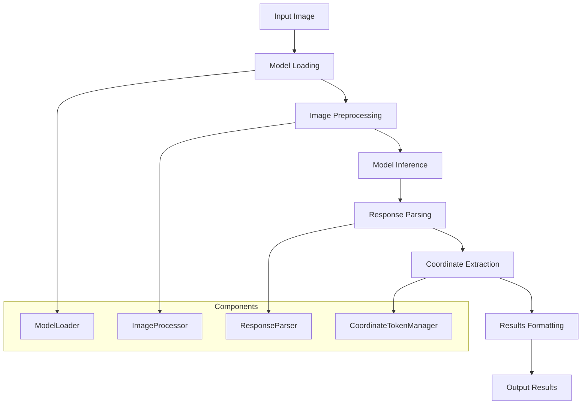

# Inference Workflow

**Complete end-to-end workflow: Trained Model → BBU Detection Results**

## Overview

This workflow takes a trained BBU detection model and performs inference on new images to detect BBU equipment and generate natural language descriptions with coordinate tokens.

## Workflow Diagram



## Prerequisites

### Model Requirements
```bash
# Verify trained model exists
ls -la output/final_model/
# Expected: pytorch_model.bin, config.json, tokenizer files

# Or use checkpoint
ls -la output/checkpoint-*/
```

### Environment Setup
```bash
# Ensure you're in the project root
cd /data3/Qwen2.5-VL-main

# Verify Python environment
/root/miniconda3/envs/ms/bin/python --version

# Check inference components
/root/miniconda3/envs/ms/bin/python -c "
from src.models.model_loader import load_model_and_processor_unified
from src.utils.response_parser import ResponseParser
print('✅ Inference system ready')
"
```

## Quick Start (2 minutes)

### Single Image Inference
```bash
# Basic inference command
/root/miniconda3/envs/ms/bin/python src/inference.py \
    --model_path output/final_model \
    --image_path path/to/test_image.jpg \
    --output_file results.json

# Check results
cat results.json | /root/miniconda3/envs/ms/bin/python -m json.tool
```

### Batch Inference
```bash
# Process multiple images
/root/miniconda3/envs/ms/bin/python src/inference.py \
    --model_path output/final_model \
    --image_dir path/to/test_images/ \
    --output_dir results/ \
    --batch_size 4
```

## Detailed Workflow Steps

### Step 1: Model Loading

**Purpose**: Load trained model with coordinate token support

```python
# Automatic model loading for inference
from src.models.model_loader import load_model_and_processor_unified

model, tokenizer, image_processor = load_model_and_processor_unified(
    model_path="output/final_model",
    for_inference=True,  # Inference mode
    attn_implementation="flash_attention_2"
)

# What happens:
# 1. Load trained model weights
# 2. Load extended tokenizer with coordinate tokens
# 3. Load image processor for VLM
# 4. Apply inference optimizations
# 5. Set model to evaluation mode
```

**Validation**:
```python
# Verify model loading
assert model.training == False  # Evaluation mode
assert len(tokenizer.get_vocab()) > 151936  # Extended vocabulary
print(f"✅ Model loaded: {type(model).__name__}")
```

### Step 2: Image Preprocessing

**Purpose**: Prepare input image for VLM processing

```python
# Image preprocessing
from PIL import Image

# Load image
image = Image.open("path/to/image.jpg")

# Process image for VLM
pixel_values = image_processor(
    images=image,
    return_tensors="pt"
).pixel_values

# What happens:
# 1. Resize image to VLM input size (typically 448x448)
# 2. Normalize pixel values
# 3. Convert to tensor format
# 4. Add batch dimension
```

### Step 3: Prompt Preparation

**Purpose**: Create appropriate prompt for BBU detection

```python
# BBU detection prompt
from src.utils.prompt import create_bbu_detection_prompt

prompt = create_bbu_detection_prompt()
# Default: "请描述图像中的BBU设备及其状态。"

# Tokenize prompt
input_ids = tokenizer.encode(
    f"<image>\n{prompt}",
    return_tensors="pt"
)
```

### Step 4: Model Inference

**Purpose**: Generate BBU detection results with coordinate tokens

```python
# Generate response
with torch.no_grad():
    generated_ids = model.generate(
        input_ids=input_ids,
        pixel_values=pixel_values,
        max_new_tokens=512,
        do_sample=False,
        temperature=0.0,
        pad_token_id=tokenizer.eos_token_id
    )

# Decode response
response = tokenizer.decode(
    generated_ids[0][input_ids.shape[1]:],
    skip_special_tokens=False
)

# Example response:
# "<|box_start|><coord_264><coord_144><coord_326><coord_201><|box_end|> <|object_ref_start|>BBU设备/显示完整,符合要求<|object_ref_end|>"
```

### Step 5: Response Parsing

**Purpose**: Extract structured information from model response

```python
# Parse response for structured data
from src.utils.response_parser import ResponseParser

parser = ResponseParser()
parsed_results = parser.parse_response(response)

# Parsed structure:
{
    "objects": [
        {
            "geometry_type": "bbox_2d",
            "coordinates": [264, 144, 326, 201],
            "description": "BBU设备/显示完整,符合要求",
            "confidence": 0.95
        }
    ],
    "raw_response": response
}
```

### Step 6: Coordinate Processing

**Purpose**: Convert coordinate tokens back to pixel coordinates

```python
# Convert coordinate tokens to pixel coordinates
from src.utils.coordinate_token_manager import convert_tokens_to_coordinates

for obj in parsed_results["objects"]:
    # Coordinate tokens are already converted by ResponseParser
    # Scale coordinates to original image size if needed
    original_size = image.size
    scaled_coords = scale_coordinates(
        obj["coordinates"],
        from_size=(448, 448),  # VLM input size
        to_size=original_size
    )
    obj["scaled_coordinates"] = scaled_coords
```

## Inference Modes

### Single Object Detection
```python
# Detect single most prominent BBU equipment
response = model.generate(
    input_ids=input_ids,
    pixel_values=pixel_values,
    max_new_tokens=256,
    do_sample=False
)
```

### Multi-Object Detection
```python
# Detect all BBU equipment in image
prompt = "请详细描述图像中所有的BBU设备及其状态。"
response = model.generate(
    input_ids=tokenizer.encode(f"<image>\n{prompt}", return_tensors="pt"),
    pixel_values=pixel_values,
    max_new_tokens=1024,
    do_sample=False
)
```

### Specific Object Type Detection
```python
# Detect specific object types
prompts = {
    "equipment": "请描述图像中的BBU设备。",
    "labels": "请识别图像中的标签文字。",
    "cables": "请描述图像中的光纤和电线。"
}

for obj_type, prompt in prompts.items():
    response = model.generate(...)
```

## Output Formats

### JSON Output Format
```json
{
  "image_path": "path/to/image.jpg",
  "image_size": [1920, 1080],
  "objects": [
    {
      "geometry_type": "bbox_2d",
      "coordinates": [264, 144, 326, 201],
      "scaled_coordinates": [528, 288, 652, 402],
      "description": "BBU设备/显示完整,符合要求",
      "object_type": "bbu",
      "attributes": ["显示完整", "符合要求"],
      "confidence": 0.95
    },
    {
      "geometry_type": "line",
      "coordinates": [579, 1385, 679, 1451, 764, 1444],
      "description": "光纤/有保护措施",
      "object_type": "fiber",
      "attributes": ["有保护措施"],
      "confidence": 0.88
    }
  ],
  "raw_response": "<|box_start|><coord_264>...",
  "processing_time": 2.34,
  "model_version": "bbu-detection-v1.0"
}
```

### Visualization Output
```python
# Generate visualization with bounding boxes
from src.utils.visualization import draw_detection_results

# Draw results on image
annotated_image = draw_detection_results(
    image=image,
    results=parsed_results,
    show_labels=True,
    show_confidence=True
)

# Save annotated image
annotated_image.save("results/annotated_image.jpg")
```

## Advanced Inference Features

### Batch Processing
```python
# Process multiple images efficiently
def batch_inference(image_paths, model, tokenizer, image_processor, batch_size=4):
    results = []
    
    for i in range(0, len(image_paths), batch_size):
        batch_paths = image_paths[i:i+batch_size]
        
        # Load and process batch
        images = [Image.open(path) for path in batch_paths]
        pixel_values = image_processor(images, return_tensors="pt").pixel_values
        
        # Generate batch responses
        with torch.no_grad():
            generated_ids = model.generate(
                input_ids=input_ids.repeat(len(images), 1),
                pixel_values=pixel_values,
                max_new_tokens=512,
                do_sample=False
            )
        
        # Process batch results
        for j, path in enumerate(batch_paths):
            response = tokenizer.decode(generated_ids[j], skip_special_tokens=False)
            parsed = parser.parse_response(response)
            results.append({"image_path": path, **parsed})
    
    return results
```

### Confidence Thresholding
```python
# Filter results by confidence
def filter_by_confidence(results, min_confidence=0.8):
    filtered_objects = []
    for obj in results["objects"]:
        if obj.get("confidence", 0) >= min_confidence:
            filtered_objects.append(obj)
    results["objects"] = filtered_objects
    return results
```

### Multi-Geometry Handling
```python
# Handle different geometry types
def process_geometry(obj):
    if obj["geometry_type"] == "bbox_2d":
        # Standard rectangular bounding box
        x1, y1, x2, y2 = obj["coordinates"]
        return {"type": "rectangle", "bbox": [x1, y1, x2, y2]}
    
    elif obj["geometry_type"] == "square":
        # Rotated quadrilateral
        coords = obj["coordinates"]  # 8 coordinates
        return {"type": "quadrilateral", "points": coords}
    
    elif obj["geometry_type"] == "line":
        # Multi-point line
        coords = obj["coordinates"]  # Variable length
        points = [(coords[i], coords[i+1]) for i in range(0, len(coords), 2)]
        return {"type": "polyline", "points": points}
```

## Performance Optimization

### GPU Optimization
```python
# Enable inference optimizations
model = model.half()  # Use FP16 for faster inference
model = model.cuda()  # Move to GPU

# Enable optimized attention
torch.backends.cuda.enable_flash_sdp(True)
```

### Memory Optimization
```python
# Clear cache between inferences
torch.cuda.empty_cache()

# Use gradient checkpointing for large images
model.gradient_checkpointing_enable()
```

### Speed Benchmarking
```python
# Measure inference speed
import time

start_time = time.time()
response = model.generate(...)
inference_time = time.time() - start_time

print(f"Inference time: {inference_time:.2f} seconds")
```

## Troubleshooting

### Common Inference Issues

#### Model Loading Failures
```python
# Issue: Model path not found
import os
assert os.path.exists(model_path), f"Model not found: {model_path}"

# Issue: Incompatible model format
# Solution: Verify model was saved correctly
files = os.listdir(model_path)
required_files = ["pytorch_model.bin", "config.json", "tokenizer.json"]
for file in required_files:
    assert file in files, f"Missing file: {file}"
```

#### Generation Issues
```python
# Issue: Model generates invalid coordinate tokens
# Solution: Check coordinate token setup
coord_token_id = tokenizer.convert_tokens_to_ids("<coord_100>")
assert coord_token_id != tokenizer.unk_token_id, "Coordinate tokens not properly loaded"

# Issue: Generation is too slow
# Solution: Reduce max_new_tokens or enable optimizations
response = model.generate(
    max_new_tokens=256,  # Reduce from 512
    do_sample=False,     # Disable sampling
    use_cache=True       # Enable KV cache
)
```

#### Parsing Failures
```python
# Issue: Response parsing fails
# Solution: Check response format and add error handling
try:
    parsed = parser.parse_response(response)
except Exception as e:
    print(f"Parsing failed: {e}")
    print(f"Raw response: {response}")
    # Fallback to basic parsing
```

### Validation and Testing
```python
# Test inference pipeline
def test_inference_pipeline():
    # Load test image
    test_image = "path/to/test_image.jpg"
    assert os.path.exists(test_image)
    
    # Run inference
    results = run_inference(test_image, model, tokenizer, image_processor)
    
    # Validate results
    assert "objects" in results
    assert len(results["objects"]) > 0
    
    for obj in results["objects"]:
        assert "coordinates" in obj
        assert "description" in obj
        assert len(obj["coordinates"]) >= 4  # At least bbox coordinates
    
    print("✅ Inference pipeline test passed")
```

## Integration Examples

### REST API Integration
```python
# Flask API for inference service
from flask import Flask, request, jsonify

app = Flask(__name__)

@app.route('/detect', methods=['POST'])
def detect_bbu():
    # Get image from request
    image_file = request.files['image']
    image = Image.open(image_file)
    
    # Run inference
    results = run_inference(image, model, tokenizer, image_processor)
    
    return jsonify(results)
```

### Batch Processing Script
```bash
# Process directory of images
/root/miniconda3/envs/ms/bin/python -c "
import os
from src.inference import batch_inference

image_dir = 'test_images/'
output_dir = 'results/'

image_paths = [os.path.join(image_dir, f) for f in os.listdir(image_dir) if f.endswith(('.jpg', '.jpeg', '.png'))]
results = batch_inference(image_paths, batch_size=4)

# Save results
for i, result in enumerate(results):
    with open(f'{output_dir}/result_{i}.json', 'w') as f:
        json.dump(result, f, indent=2, ensure_ascii=False)
"
```

---

**Next Steps**:
- **Training Workflow**: [training.md](training.md)
- **Data Processing**: [data-processing.md](data-processing.md)
- **Model Components**: [../components/model-system.md](../components/model-system.md)
