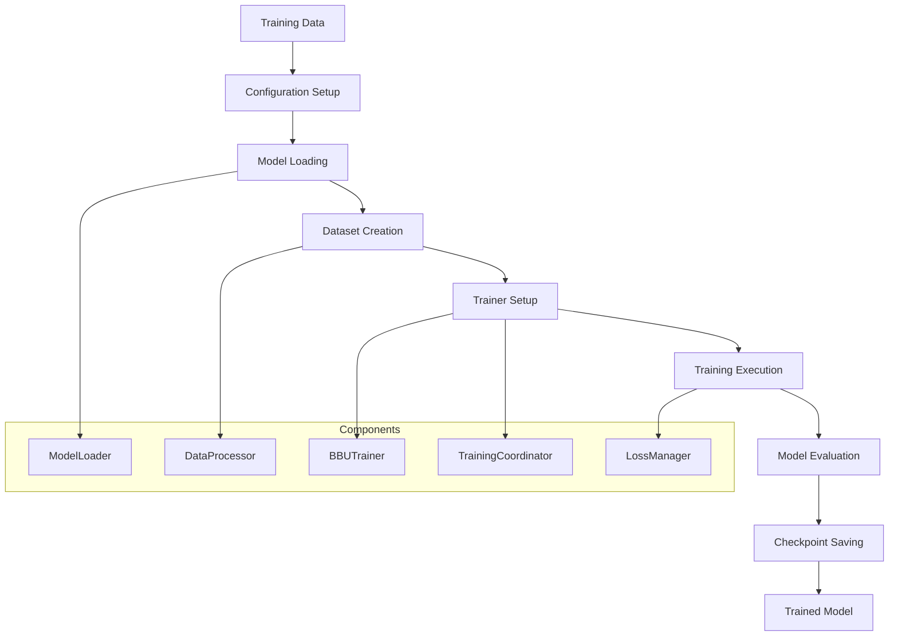

# Training Workflow

**Complete end-to-end workflow: Training Data → Trained Model**

## Overview

This workflow takes processed training data and trains a Qwen2.5-VL model with coordinate token support for BBU equipment detection. The training uses a modular system with multi-component loss tracking and teacher-student learning.

## Workflow Diagram



## Prerequisites

### Data Requirements
```bash
# Verify processed training data exists
ls -la data/
# Expected: train.jsonl, val.jsonl, teacher.jsonl

# Check data format
head -1 data/train.jsonl | /root/miniconda3/envs/ms/bin/python -m json.tool
```

### Environment Setup
```bash
# Ensure you're in the project root
cd /data3/Qwen2.5-VL-main

# Verify Python environment
/root/miniconda3/envs/ms/bin/python --version

# Check training system components
/root/miniconda3/envs/ms/bin/python -c "
from src.training.trainer import BBUTrainer
from src.models.model_loader import load_model_and_processor_unified
print('✅ Training system ready')
"
```

### GPU Requirements
```bash
# Check GPU availability
nvidia-smi

# Recommended: 4x A100 (40GB each) or 2x A100 (80GB each)
# Minimum: 2x RTX 3090 (24GB each) with reduced batch size
```

## Quick Start (30 minutes)

### Option 1: Factory Pattern (Recommended)
```bash
# Use trainer factory for automatic setup
/root/miniconda3/envs/ms/bin/python scripts/train.py \
    --config configs/base_flat_v2.yaml \
    --output_dir ./output/quick_training
```

### Option 2: Custom Configuration
```bash
# Create custom config
cp configs/base_flat_v2.yaml configs/my_training.yaml

# Edit key parameters
sed -i 's/num_train_epochs: 3/num_train_epochs: 2/' configs/my_training.yaml
sed -i 's/per_device_train_batch_size: 2/per_device_train_batch_size: 1/' configs/my_training.yaml

# Start training
/root/miniconda3/envs/ms/bin/python scripts/train.py \
    --config configs/my_training.yaml
```

## Detailed Workflow Steps

### Step 1: Configuration Setup

**Purpose**: Define training parameters and system behavior

```yaml
# Key configuration parameters (configs/base_flat_v2.yaml)
model_path: "/path/to/qwen2.5-vl-7b-instruct"
train_data_path: "data/train.jsonl"
val_data_path: "data/val.jsonl"

# Detection settings
detection_enabled: true
coordinate_tokens_enabled: true
max_coord_value: 2048

# Training parameters
learning_rate: 1e-5
num_train_epochs: 3
per_device_train_batch_size: 2
gradient_accumulation_steps: 4

# Teacher-student learning
teacher_ratio: 0.3
teacher_loss_weight: 0.3
student_loss_weight: 1.0
```

**Validation**:
```bash
# Test configuration loading
/root/miniconda3/envs/ms/bin/python -c "
from src.config import get_config
config = get_config()
print(f'✅ Config loaded: {config.model_path}')
"
```

### Step 2: Model Loading

**Purpose**: Load Qwen2.5-VL with coordinate token support

```python
# Automatic model loading via ModelLoader
from src.models.model_loader import load_model_and_processor_unified

model, tokenizer, image_processor = load_model_and_processor_unified(
    model_path=config.model_path,
    for_inference=False,
    attn_implementation="flash_attention_2"
)

# What happens automatically:
# 1. Load base Qwen2.5-VL model
# 2. Add coordinate tokens (0-2047) to vocabulary
# 3. Add geometry tokens (<|box_start|>, <|box_end|>, etc.)
# 4. Resize model embeddings
# 5. Apply model patches (mRoPE fix, Flash Attention 2)
```

**Validation**:
```bash
# Test model loading
/root/miniconda3/envs/ms/bin/python -c "
from src.models.model_loader import load_model_and_processor_unified
model, tokenizer, _ = load_model_and_processor_unified('/path/to/model', for_inference=False)
print(f'✅ Model loaded: {type(model).__name__}')
print(f'✅ Vocab size: {len(tokenizer.get_vocab())}')
"
```

### Step 3: Dataset Creation

**Purpose**: Create training and validation datasets with coordinate token support

```python
# Automatic dataset creation via DataProcessor
from src.core.data_processor import DataProcessor

processor = DataProcessor(tokenizer, image_processor, model)
train_dataset, eval_dataset = processor.create_datasets()
data_collator = processor.create_data_collator()

# What happens:
# 1. Load JSONL files (train.jsonl, val.jsonl)
# 2. Convert to BBUDataset format
# 3. Apply coordinate token processing
# 4. Create teacher pool for teacher-student learning
# 5. Setup data collator for batching
```

**Validation**:
```bash
# Test dataset creation
/root/miniconda3/envs/ms/bin/python -c "
from src.core.data_processor import DataProcessor
from src.models.model_loader import load_model_and_processor_unified
model, tokenizer, image_processor = load_model_and_processor_unified('/path/to/model', for_inference=False)
processor = DataProcessor(tokenizer, image_processor, model)
train_ds, eval_ds = processor.create_datasets()
print(f'✅ Train samples: {len(train_ds)}')
print(f'✅ Eval samples: {len(eval_ds)}')
"
```

### Step 4: Training Coordinator Setup

**Purpose**: Orchestrate multi-task training with coordinate tokens

```python
# Training coordinator setup
from src.training.training_coordinator import TrainingCoordinator

coordinator = TrainingCoordinator(
    model=model,
    tokenizer=tokenizer,
    config_obj=config
)
coordinator.setup_training()

# What happens:
# 1. Initialize LossManager for multi-component loss
# 2. Setup teacher-student learning parameters
# 3. Configure coordinate token handling
# 4. Prepare training state management
```

### Step 5: Trainer Creation

**Purpose**: Create enhanced BBUTrainer with all components

```python
# BBUTrainer with coordinator integration
from src.training.trainer import BBUTrainer

trainer = BBUTrainer(
    model=model,
    args=training_args,
    train_dataset=train_dataset,
    eval_dataset=eval_dataset,
    data_collator=data_collator,
    cfg=config,
    image_processor=image_processor,
    training_coordinator=coordinator
)

# Enhanced features:
# 1. Multi-component loss logging (LLM + coordinate)
# 2. Teacher-student learning support
# 3. Coordinate token validation
# 4. Training stability monitoring
```

### Step 6: Training Execution

**Purpose**: Execute training with monitoring and checkpointing

```python
# Start training
trainer.train()

# Training loop includes:
# 1. Forward pass with coordinate token processing
# 2. Multi-component loss computation
# 3. Teacher-student loss splitting
# 4. Gradient computation and optimization
# 5. Periodic evaluation and checkpointing
```

**Expected Training Output**:
```
🏭 Creating trainer with new coordinator system...
✅ Model loading with patches applied
✅ Training system OK
✅ Data pipeline OK

🎯 Training started...
Step 10: loss=2.345, llm_loss=1.234, coordinate_l1_loss=0.567, teacher_loss=0.123, student_loss=2.222
Step 20: loss=2.123, llm_loss=1.098, coordinate_l1_loss=0.432, teacher_loss=0.109, student_loss=2.014
...
```

## Training Configurations

### Standard Training (Recommended)
```yaml
# configs/standard_training.yaml
learning_rate: 1e-5
num_train_epochs: 3
per_device_train_batch_size: 2
gradient_accumulation_steps: 4
teacher_ratio: 0.3
```

### Memory-Constrained Training
```yaml
# configs/low_memory_training.yaml
per_device_train_batch_size: 1
gradient_accumulation_steps: 16
gradient_checkpointing: true
model_max_length: 60000
dataloader_num_workers: 2
```

### Fast Experimentation
```yaml
# configs/fast_experiment.yaml
num_train_epochs: 1
per_device_train_batch_size: 4
logging_steps: 5
save_steps: 100
eval_steps: 100
max_steps: 500
```

### Production Training
```yaml
# configs/production_training.yaml
num_train_epochs: 5
per_device_train_batch_size: 2
gradient_accumulation_steps: 8
save_steps: 1000
eval_steps: 1000
save_total_limit: 5
warmup_ratio: 0.1
lr_scheduler_type: "cosine"
```

## Monitoring and Evaluation

### Training Metrics
```bash
# Monitor training progress
tail -f output/training.log

# Key metrics to watch:
# - loss: Total training loss (should decrease)
# - llm_loss: Language modeling component
# - coordinate_l1_loss: Coordinate prediction accuracy
# - teacher_loss: Teacher sample loss
# - student_loss: Student sample loss
```

### GPU Monitoring
```bash
# Monitor GPU utilization
watch -n 1 nvidia-smi

# Expected utilization: 80-95% GPU usage
# Memory usage: ~60-70GB for 4x A100 setup
```

### Training Health Checks
```bash
# Check training progress
grep "Step" output/training.log | tail -10

# Check for errors
grep -i "error\|exception\|failed" output/training.log

# Check checkpoint creation
ls -la output/checkpoint-*
```

## Advanced Training Features

### Teacher-Student Learning
```python
# Automatic teacher-student splitting
# Teachers: High-quality samples from teacher.jsonl (LLM loss only)
# Students: Model's own predictions (LLM + coordinate loss)
# Ratio controlled by teacher_ratio parameter (default: 0.3)

# Loss computation:
teacher_loss = llm_loss * teacher_ratio
student_loss = (llm_loss + coordinate_l1_loss) * student_ratio
total_loss = teacher_loss + student_loss
```

### Multi-Component Loss Tracking
```python
# Automatic loss component logging
logs = {
    'loss': total_loss.item(),
    'llm_loss': llm_loss.item(),
    'coordinate_l1_loss': coord_loss.item(),
    'teacher_loss': teacher_loss.item(),
    'student_loss': student_loss.item()
}
```

### Coordinate Token Validation
```python
# Automatic validation during training
# - Coordinate token range checking (0-2047)
# - Geometry consistency validation
# - Format compliance checking
```

## Checkpointing and Model Saving

### Automatic Checkpointing
```bash
# Checkpoints saved automatically based on save_steps
ls -la output/checkpoint-*

# Each checkpoint contains:
# - Model weights with coordinate token support
# - Tokenizer with extended vocabulary
# - Training state and optimizer state
# - Configuration and metadata
```

### Manual Model Saving
```python
# Save model manually
trainer.save_model("output/final_model")

# Save with additional metadata
trainer.model.save_pretrained("output/final_model")
trainer.tokenizer.save_pretrained("output/final_model")
```

### Model Loading for Inference
```python
# Load trained model for inference
from src.models.model_loader import load_model_and_processor_unified

model, tokenizer, image_processor = load_model_and_processor_unified(
    model_path="output/final_model",
    for_inference=True
)
```

## Troubleshooting

### Common Training Issues

#### CUDA Out of Memory
```bash
# Reduce batch size
sed -i 's/per_device_train_batch_size: [0-9]*/per_device_train_batch_size: 1/' configs/my_training.yaml

# Enable gradient checkpointing
sed -i 's/gradient_checkpointing: false/gradient_checkpointing: true/' configs/my_training.yaml

# Reduce sequence length
sed -i 's/model_max_length: [0-9]*/model_max_length: 60000/' configs/my_training.yaml
```

#### Training Not Converging
```bash
# Check learning rate
grep "learning_rate:" configs/my_training.yaml

# Check data quality
head -5 data/train.jsonl | /root/miniconda3/envs/ms/bin/python -m json.tool

# Check coordinate token setup
grep -i "coordinate" output/training.log
```

#### Slow Training Speed
```bash
# Enable Flash Attention 2
sed -i 's/attn_implementation: ".*"/attn_implementation: "flash_attention_2"/' configs/my_training.yaml

# Increase batch size (if memory allows)
sed -i 's/per_device_train_batch_size: [0-9]*/per_device_train_batch_size: 4/' configs/my_training.yaml

# Reduce dataloader workers if I/O bound
sed -i 's/dataloader_num_workers: [0-9]*/dataloader_num_workers: 2/' configs/my_training.yaml
```

### Training Validation
```bash
# Pre-training validation
/root/miniconda3/envs/ms/bin/python -c "
# Test all components
from src.training.trainer_factory import create_trainer_with_coordinator
from transformers import TrainingArguments

args = TrainingArguments(
    output_dir='./test_output',
    num_train_epochs=1,
    per_device_train_batch_size=1,
    logging_steps=1
)

trainer = create_trainer_with_coordinator(args)
print('✅ Training setup validation passed')
"
```

## Performance Optimization

### Memory Optimization
```yaml
# Enable all memory optimizations
gradient_checkpointing: true
dataloader_pin_memory: false
dataloader_num_workers: 2
remove_unused_columns: false
```

### Speed Optimization
```yaml
# Enable speed optimizations
attn_implementation: "flash_attention_2"
torch_dtype: "bfloat16"
tf32: true
```

### Distributed Training
```bash
# Multi-GPU training
torchrun --nproc_per_node=4 scripts/train.py \
    --config configs/distributed_training.yaml
```

---

**Next Steps**:
- **Inference Workflow**: [inference.md](inference.md)
- **Data Processing**: [data-processing.md](data-processing.md)
- **Training Components**: [../components/training-system.md](../components/training-system.md)
