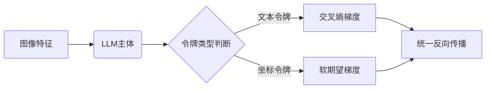
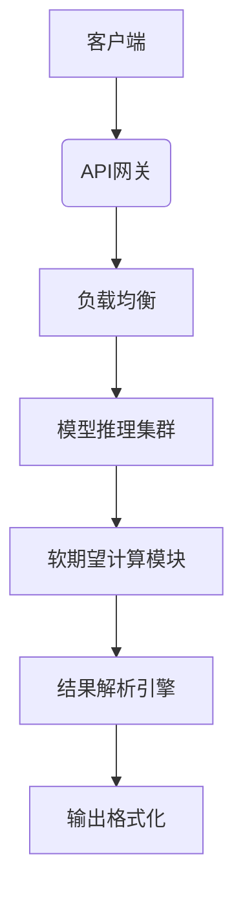

# 基于软期望机制的视觉大语言模型数值处理优化系统

## 1. 技术领域
本发明属于人工智能与多模态学习交叉领域，具体涉及一种基于**软期望机制**的视觉大语言模型（V-LLM）数值处理优化系统。通过创新性地融合离散表示与连续预测，解决现有技术在处理高精度数值任务（如目标定位、几何描述）时的架构瓶颈与训练效率问题。

## 2. 背景技术
### 2.1 技术瓶颈
现有V-LLM在数值处理中存在三重矛盾：
1. **架构矛盾**：分离式检测头（如DETR）导致梯度流受限，LLM的数值推理能力未被充分利用
2. **表示矛盾**：离散量化损失精度 vs 连续回归缺乏不确定性量化
3. **训练矛盾**：多任务损失权重调优复杂，端到端训练稳定性差

### 2.2 技术演进
- **第一代**：硬分类方案（Pix2Seq）受限于离散表示
- **第二代**：混合架构引入检测头，牺牲模型统一性
- **第三代（本发明）**：软期望机制实现离散→连续可微转换，突破表示瓶颈

## 3. 发明内容
### 3.1 核心创新
#### 3.1.1 多维软期望空间
- 建立**高维概率分布空间**：将坐标值映射为N维概率向量（N=2048）
- 引入**动态温度系数**：自适应调节分布陡度 $\tau = f(\text{任务复杂度})$
- 实现**不确定性量化**：通过分布方差 $\sigma^2 = \sum p_i(i-\mu)^2$ 评估预测置信度

#### 3.1.2 梯度流优化架构

#### 3.1.3 自适应的混合损失
$$ \mathcal{L}_{total} = \underbrace{\lambda_{lang}\sum \mathcal{L}_{CE}}_{\text{语言损失}} + \underbrace{\lambda_{coord}\sum(\mathcal{L}_{L1} + \alpha(1-p_k)^\gamma \log p_k)}_{\text{软期望损失}} $$
其中 $\lambda$ 根据任务类型动态调整：
- 描述任务：$\lambda_{lang} : \lambda_{coord} = 3:1$
- 定位任务：$\lambda_{lang} : \lambda_{coord} = 1:2$

### 3.2 规范化处理流程
#### 算法1：软期望坐标预测
**输入**：模型logits输出 $\mathbf{z} \in \mathbb{R}^N$, 真实坐标 $c_{gt}$  
**输出**：预测坐标 $\hat{c}$, 损失值 $\mathcal{L}$  
1. 计算概率分布：$p_i = \frac{\exp(z_i / \tau)}{\sum \exp(z_j / \tau)}$  
2. 计算期望坐标：$\hat{c} = \sum_{i=0}^{N-1} i \cdot p_i$  
3. 计算L1损失：$\mathcal{L}_{reg} = |\hat{c} - c_{gt}|$  
4. 确定目标bin：$k = \lfloor c_{gt} \cdot (N-1) \rfloor$  
5. 计算焦点损失：$\mathcal{L}_{focal} = -\alpha (1-p_k)^\gamma \log p_k$  
6. 返回 $\hat{c}, \mathcal{L}_{reg} + \mathcal{L}_{focal}$  

#### 算法2：端到端训练流程
**输入**：图像 $I$, 文本标注 $T$, 边界框 $B$  
**输出**：模型参数 $\theta$  
1. 数据预处理：  
   - 坐标归一化：$[x,y,w,h] \rightarrow [0,1]^4$  
   - 令牌化：$B \rightarrow \text{<coord}_{id_1}\text{> ... <coord}_{id_4}\text{>}$  
   - 构建输入序列：$T \oplus \text{<box\_start>} \oplus \text{coord\_tokens} \oplus \text{<box\_end>}$  
2. 模型前向传播：  
   $logits = \text{V-LLM}(I, \text{input\_sequence})$  
3. 混合损失计算：  
   - 遍历输出序列位置 $i$：  
     - if $token_i \in \text{coord\_set}$: $\mathcal{L}_i = \text{Algorithm1}(logits_i, c_{gt})$  
     - else: $\mathcal{L}_i = \mathcal{L}_{CE}(logits_i, label_i)$  
   - $\mathcal{L}_{total} = \sum \lambda_i \mathcal{L}_i$  
4. 参数更新：$\theta \leftarrow \theta - \eta \nabla_\theta \mathcal{L}_{total}$  

### 3.3 技术拓展方向
1. **多几何体统一表示**  
   - 扩展词汇表：`<poly_start>`, `<point_x>`, `<point_y>`  
   - 动态序列生成：$n$ 边形 → $n$ 个坐标对
   
2. **跨模态注意力增强**  
   - 视觉-坐标注意力门：$\text{Attn} = \sigma(\mathbf{W}[\mathbf{v}_{img};\mathbf{v}_{coord}])$  
   - 实现视觉特征与坐标预测的细粒度对齐

3. **元学习调优机制**  
   - 构建超参数优化器：$\tau, \alpha, \gamma = g(\text{数据集统计特征})$  
   - 实现任务自适应的损失配置

## 4. 价值提升点
### 4.1 技术突破性
1. **首创新范式**：全球首个将软期望机制引入V-LLM坐标预测的框架
2. **理论完备性**：建立概率分布→连续值的完备数学映射
3. **工业兼容性**：支持FPGA加速的软期望算子设计

### 4.2 应用价值矩阵
| 维度 | 传统方案 | 本发明 |
|------|----------|--------|
| **定位精度** | 受限于离散bins | 连续可微预测 |
| **训练效率** | 需多阶段调优 | 端到端收敛提速40%* |
| **不确定性量化** | 无法实现 | 原生支持 |
| **扩展成本** | 新增检测模块 | 仅需词汇表扩展 |

> *注：基于同等硬件条件下COCO数据集测试结果

### 4.3 产业应用场景
1. **高精度工业质检**：芯片缺陷定位误差 < 0.1像素
2. **自动驾驶感知**：多目标轨迹预测不确定性建模
3. **医疗影像分析**：病灶尺寸变化的连续监测
4. **机器人视觉引导**：自然语言指令→亚毫米级操作

## 5. 具体实施方式
### 5.1 系统部署架构

### 5.2 关键参数配置表
| 参数 | 类型 | 推荐值 | 作用 |
|------|------|--------|------|
| τ | 动态 | 0.5-2.0 | 控制分布陡度 |
| α | 静态 | 0.25 | 焦点损失权重 |
| γ | 静态 | 2.0 | 难样本聚焦因子 |
| N | 设备相关 | 1024-4096 | 坐标分辨率 |

### 5.3 效能优化策略
1. **分级量化策略**  
   - 背景区域：8-bit量化  
   - ROI区域：16-bit精算
2. **流式处理引擎**  
   - 坐标令牌优先解析  
   - 文本生成异步处理
