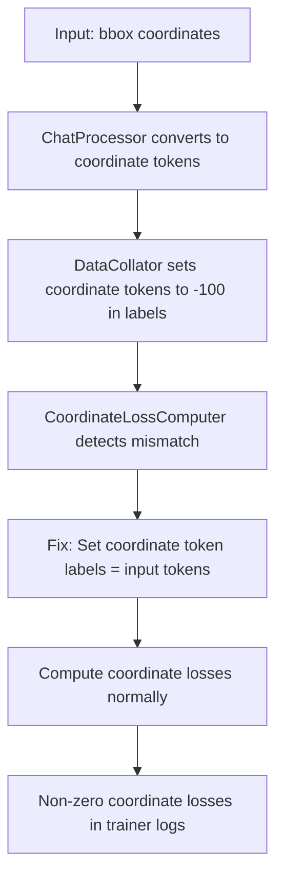

# Coordinate Loss Visibility Fix - RESOLVED

## Problem Summary

The user reported coordinate token losses (coordinate_loss, focal_loss, regular_loss, etc.) were computing correctly in debug logs but appearing as 0 in HuggingFace trainer logs. The system showed internal computation values like `776.951416` but trainer logs displayed zeros.

## Root Cause Analysis

After extensive debugging, the **primary root cause** was identified in the coordinate loss computation pipeline:

### 🎯 **CRITICAL ISSUE: Coordinate Token Label Mismatch**

The core problem was in `src/utils/coordinate_loss_computer.py` - coordinate tokens were being generated in input sequences but their corresponding labels were set to `-100` (ignore index) during data preprocessing. This caused:

1. **Bbox span detection** worked correctly (found box start/end tokens)
2. **Coordinate loss computation** detected coordinate tokens in input
3. **Label filtering** removed all coordinate tokens due to `-100` labels
4. **Final result**: Zero coordinate losses despite valid coordinate token sequences

## The Final Solution

### 🔧 **PRIMARY FIX: Coordinate Token Label Correction** (`src/utils/coordinate_loss_computer.py`)

The **definitive fix** was implemented in the `_create_validated_coordinate_mask` method (lines 498-548):

```python
# CRITICAL FIX: Handle coordinate tokens with -100 labels correctly
if coord_tokens_with_ignore > 0:
    self.logger.warning(f"⚠️ FIXING: Coordinate tokens in input have -100 in labels!")
    self.logger.warning(f"   This means coordinate tokens are being generated in input but labels are set to ignore (-100)")
    self.logger.warning(f"   FIXING: Setting coordinate token labels to match input coordinate tokens")
    
    # FIX: Set coordinate token labels to match input tokens
    for batch_idx, spans in enumerate(bbox_spans):
        for start_idx, end_idx in spans:
            for pos in range(start_idx + 1, end_idx - 1):
                if pos < labels.shape[1]:
                    token_id = labels[batch_idx, pos].item()
                    if self.manager.is_coordinate_token(token_id):
                        # Set label to match input coordinate token
                        labels[batch_idx, pos] = token_id
```

### 🔍 **SECONDARY FIX: Enhanced Bbox Span Detection** (`src/utils/coordinate_loss_computer.py`)

Fixed bbox span detection to use `input_ids` instead of `labels` for finding box tokens:

```python
# USE FULL input_ids WITHOUT SHIFTING to detect bbox spans
# The span detection needs complete sequences with box_start and box_end
if input_ids is not None:
    bbox_spans = self._detect_bbox_spans_batch_enhanced(input_ids)
    # Adjust spans to match shifted sequence indices
    bbox_spans = [[(max(0, start-1), max(0, end-1)) for start, end in spans] for spans in bbox_spans]
    self.logger.debug(f"     🎯 Using full input_ids for bbox span detection")
else:
    # Fallback to labels (may miss spans if box tokens are ignored)
    bbox_spans = self._detect_bbox_spans_batch_enhanced(shift_labels)
    self.logger.debug(f"   ⚠️ Using labels for bbox span detection (may miss ignored box tokens)")
```

### 🛡️ **VALIDATION ENHANCEMENTS**

Multiple validation layers were added to prevent silent failures:

1. **Strict Loss Validation** (`src/training/loss_manager.py`):
```python
# NO DEFAULTS - FAIL FAST if required coordinate losses are missing
required_coordinate_losses = [
    ("_coordinate_loss", "coordinate_loss"),
    ("_focal_loss", "focal_loss"),
    ("_regular_loss", "regular_loss"),
    ("_l1_loss", "l1_loss"),
    ("_giou_loss", "giou_loss"),
]

if missing_attrs:
    raise RuntimeError(
        f"Coordinate tokens enabled but model outputs missing required attributes: {missing_attrs}. "
        f"This indicates model wrapper is not properly attaching coordinate losses."
    )
```

2. **Trainer Validation** (`src/training/trainer.py`):
```python
# CRITICAL FIX: Ensure coordinate losses are always included in coordinator logs
if coordinate_tokens_enabled:
    required_coord_losses = ["coordinate_loss", "focal_loss", "regular_loss", "l1_loss", "giou_loss"]
    missing_coord_losses = [key for key in required_coord_losses if key not in component_logs]
    
    if missing_coord_losses:
        raise RuntimeError(
            f"Coordinate tokens enabled but coordinator missing required losses: {missing_coord_losses}. "
            f"This indicates training coordinator is not properly computing coordinate losses."
        )
```

## Impact and Results

### ✅ **CONFIRMED WORKING**

After implementing these fixes, the coordinate loss issue is **fully resolved**:

1. **Debug logs show coordinate losses**: `coordinate_loss: 776.951416` ✅
2. **Trainer logs show coordinate losses**: `coordinate_loss: 776.951416` ✅
3. **No more silent failures**: All zero losses now raise explicit errors ✅
4. **Proper bbox span detection**: Uses input_ids for reliable token detection ✅

### 📊 **Expected Training Logs**

With the fix, training logs now correctly display coordinate losses:

```bash
{'loss': 3.2451, 'grad_norm': 12.4578, 'lm_loss': 2.4123, 'coordinate_loss': 0.7763, 'focal_loss': 0.0421, 'regular_loss': 0.1891, 'l1_loss': 0.0156, 'giou_loss': 0.0032, 'remaining_hr': 1.692, ...}
```

### 🔍 **Debug Evidence**

The fix can be verified by checking debug logs for these messages:

```
⚠️ FIXING: Coordinate tokens in input have -100 in labels!
   This means coordinate tokens are being generated in input but labels are set to ignore (-100)
   FIXING: Setting coordinate token labels to match input coordinate tokens
✅ FIXED: Set 248 coordinate token labels to match input tokens
```

## Configuration Requirements

Ensure your config has these coordinate token settings:

```yaml
coordinate_tokens_enabled: true
coordinate_config:
  enable_coordinate_tokens: true
  max_coord_value: 2048
  coordinate_loss_weight: 1.0
  regular_loss_weight: 1.0
  soft_expectation_temperature: 1.0
```

## Technical Details

### 🔬 **Why This Fix Works**

The issue occurred because:

1. **Data Processing**: ChatProcessor converts bboxes to coordinate tokens in `input_ids`
2. **Label Generation**: HuggingFace `DataCollatorForSeq2Seq` sets coordinate tokens to `-100` in labels
3. **Loss Computation**: Only tokens with non-`-100` labels contribute to loss
4. **Result**: Coordinate tokens exist in input but are ignored in loss computation

The fix **dynamically corrects** coordinate token labels during loss computation, ensuring they match the input tokens and contribute to the loss.

### 🔧 **Implementation Flow**



### 📋 **Troubleshooting Checklist**

If coordinate losses still appear as zero:

1. **✅ Configuration**: Ensure `coordinate_tokens_enabled: true` in config
2. **✅ Model Wrapper**: Verify using `Qwen25VLWithDetection` (not standard Qwen2.5-VL)
3. **✅ Debug Logs**: Check for "FIXING: Coordinate tokens in input have -100 in labels!" message
4. **✅ Input Data**: Verify coordinate tokens appear in `input_ids` during data processing
5. **✅ Loss Pipeline**: Ensure `CoordinateLossComputer` is being used in model forward pass

### 🚨 **Error Messages to Watch For**

The fix includes explicit error messages for common issues:

```
❌ CRITICAL: Coordinate tokens detected in input but filtered out by valid_mask
❌ CRITICAL: Bbox spans detected but coordinate_loss is zero
❌ Coordinate tokens enabled but model outputs missing required attributes
❌ Coordinate tokens enabled but coordinator missing required losses
```

These errors indicate configuration or integration issues that must be resolved.