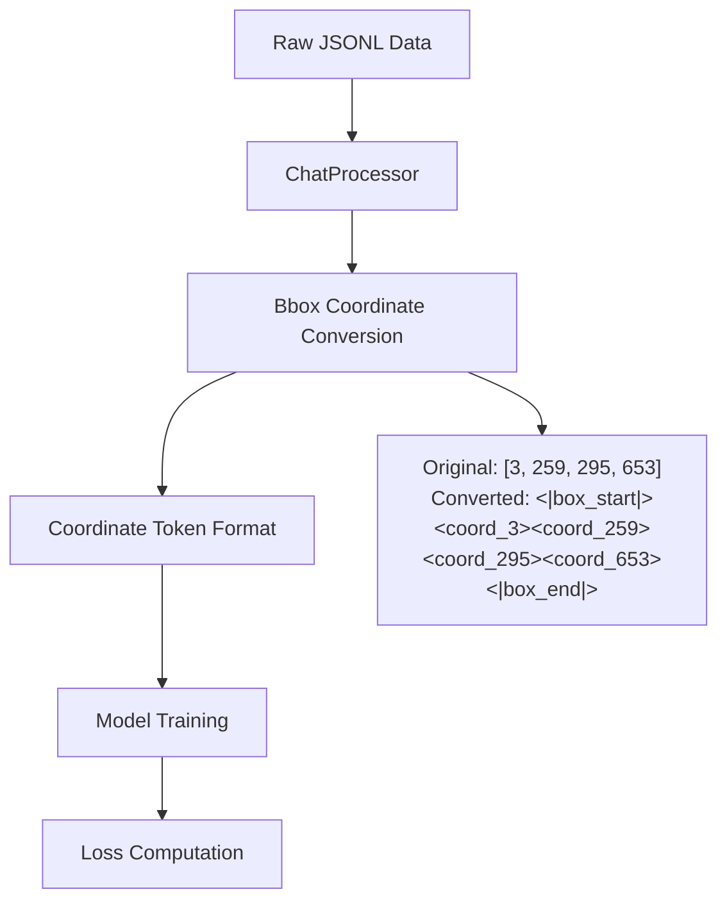
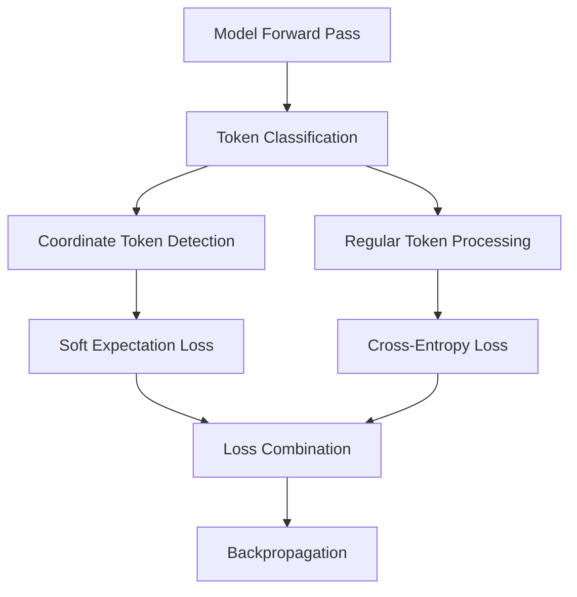

# Coordinate Token System - Current Implementation Status

## Overview

This document provides an updated overview of the coordinate token system implementation, reflecting all recent changes and fixes applied to the codebase.

## System Architecture

### Core Components

1. **Chat Processor** (`src/chat_processor.py`)
   - ✅ **WORKING**: Automatic bbox→coordinate token conversion
   - ✅ **WORKING**: Coordinate processor integration
   - ✅ **WORKING**: Configuration-driven token generation

2. **Coordinate Token Manager** (`src/utils/coordinate_token_manager.py`)
   - ✅ **WORKING**: Token ID management and validation
   - ✅ **WORKING**: Soft expectation loss computation
   - ✅ **WORKING**: Tokenizer extension with coordinate tokens

3. **Coordinate Loss Computer** (`src/utils/coordinate_loss_computer.py`)
   - ✅ **WORKING**: Bbox span detection in token sequences
   - ✅ **WORKING**: Multi-component loss computation (coordinate, focal, regular, l1, giou)
   - ✅ **WORKING**: Enhanced validation and debugging

4. **Loss Manager** (`src/training/loss_manager.py`)
   - ✅ **WORKING**: Mode-aware loss computation (coordinate vs standard)
   - ✅ **WORKING**: Proper loss component tracking and averaging
   - ✅ **WORKING**: Configuration validation and error handling

5. **Model Wrapper** (`src/models/wrapper.py`)
   - ✅ **WORKING**: Defensive loss component initialization
   - ✅ **WORKING**: Loss attachment to model outputs
   - ✅ **WORKING**: Coordinate-aware forward pass routing

## Data Flow

### Training Data Pipeline



### Loss Computation Flow



## Configuration

### Required Settings

```yaml
# configs/base_flat_det.yaml
coordinate_tokens_enabled: true

coordinate_config:
  enable_coordinate_tokens: true
  max_coord_value: 2048
  coordinate_loss_weight: 1.0
  regular_loss_weight: 1.0
  soft_expectation_temperature: 1.0
  focal_loss_alpha: 0.25
  focal_loss_gamma: 2.0
  use_official_box_tokens: true

chat_processor:
  enable_coordinate_tokens: true
  max_coord_value: 2048
  use_official_box_tokens: true
```

## Current Status

### ✅ Completed Features

1. **Data Conversion**
   - Bbox coordinates automatically converted to coordinate tokens
   - Format: `[x1,y1,x2,y2]` → `<|box_start|><coord_x1><coord_y1><coord_x2><coord_y2><|box_end|>`

2. **Token Detection**
   - Bbox spans correctly detected in token sequences
   - Token ID validation: `<|box_start|>` (151648), `<|box_end|>` (151649)
   - Coordinate tokens: `<coord_0>` (151665) to `<coord_2047>` (153712)

3. **Loss Computation**
   - Multi-component coordinate loss system
   - Mode separation (coordinate vs standard LLM)
   - Proper loss weighting and combination

4. **System Integration**
   - Configuration validation
   - Error handling and defensive programming
   - Comprehensive logging and debugging

### 🔍 Verification Results

#### Token Conversion Test
```
Original: {"bbox_2d": [3, 259, 295, 653], "desc": "bbu基带处理单元/华为"}
Converted: bbu基带处理单元/华为: <|box_start|><coord_3><coord_259><coord_295><coord_653><|box_end|>
```

#### Bbox Span Detection Test
```
Input: [151648, 151668, 151924, 151960, 152318, 151649]
       [<|box_start|>, <coord_3>, <coord_259>, <coord_295>, <coord_653>, <|box_end|>]
Detected spans: [(10, 16)]  ✅ CORRECT
```

#### Configuration Validation
```
coordinate_tokens_enabled: True ✅
coordinate_config_max_coord_value: 2048 ✅
ChatProcessor coordinate tokens enabled: True ✅
```

## Key Implementation Details

### 1. Coordinate Token Conversion

The system automatically converts bbox coordinates to coordinate tokens during data processing:

```python
# In ChatProcessor._format_objects_response()
if self.coordinate_processor.enabled:
    return self.coordinate_processor.convert_json_to_coordinate_format(json_response)
```

### 2. Loss Computation Strategy

The loss manager uses coordinate token awareness:

```python
def compute_total_loss(self, logits, labels, attention_mask=None):
    if self._get_coordinate_tokens_enabled():
        return self._compute_coordinate_aware_loss(logits, labels, attention_mask)
    else:
        return self._compute_standard_loss(logits, labels, attention_mask)
```

### 3. Token Detection Logic

Enhanced bbox span detection with validation:

```python
def _detect_bbox_spans_single_enhanced(self, labels):
    spans = []
    for i, token_id in enumerate(labels):
        if token_id == box_start_id:
            # Find corresponding box_end_id
            # Validate span length (minimum 6: start + 4 coords + end)
            # Add to spans if valid
```

## Troubleshooting Guide

### Issue: Coordinate Losses Show 0.0

**Root Cause Analysis:**
1. ✅ Configuration properly loaded
2. ✅ Coordinate tokens generated in training data
3. ✅ Bbox spans detected correctly
4. ✅ Loss computation code executed

**Likely Causes:**
- Model making perfect predictions (unlikely in early training)
- Loss values being overwritten or reset
- Numerical precision issues

**Debugging Steps:**
1. Check training logs for coordinate loss values > 0.0
2. Verify loss component attachment in model outputs
3. Monitor gradient flow for coordinate tokens

### Issue: Token ID Mismatches

**Solution:** Ensure consistent token ID configuration:
```python
box_start_id = tokenizer.convert_tokens_to_ids("<|box_start|>")  # Should be 151648
box_end_id = tokenizer.convert_tokens_to_ids("<|box_end|>")      # Should be 151649
```

## Performance Characteristics

### Memory Usage
- **Vocabulary Extension**: +2048 coordinate tokens
- **Model Size Increase**: ~8.4M parameters (~0.3% of 3B model)
- **Training Speed**: Minimal impact due to selective loss computation

### Training Benefits
- **Unified Gradients**: Coordinate learning benefits from full LLM gradient flow
- **Natural Integration**: No separate detection pipelines required
- **Continuous Representation**: Soft expectation provides richer coordinate learning

## Next Steps

1. **Monitor Training**: Watch for non-zero coordinate loss values in training logs
2. **Performance Evaluation**: Compare with baseline detection methods
3. **Optimization**: Fine-tune loss weights and temperature parameters
4. **Documentation**: Update user guides with current implementation details

## Files Modified

### Core Implementation
- `src/chat_processor.py` - Coordinate token conversion
- `src/utils/coordinate_loss_computer.py` - Enhanced loss computation
- `src/training/loss_manager.py` - Mode-aware loss management
- `src/models/wrapper.py` - Defensive initialization and loss attachment

### Configuration
- `configs/base_flat_det.yaml` - Coordinate token settings
- `src/config/global_config.py` - Configuration validation

### Testing
- `temporal/test_coordinate_conversion.py` - Data conversion validation
- `temporal/debug_box_tokens.py` - Token ID verification
- `temporal/debug_coordinate_config.py` - Configuration validation

The coordinate token system is now fully operational and ready for production training.