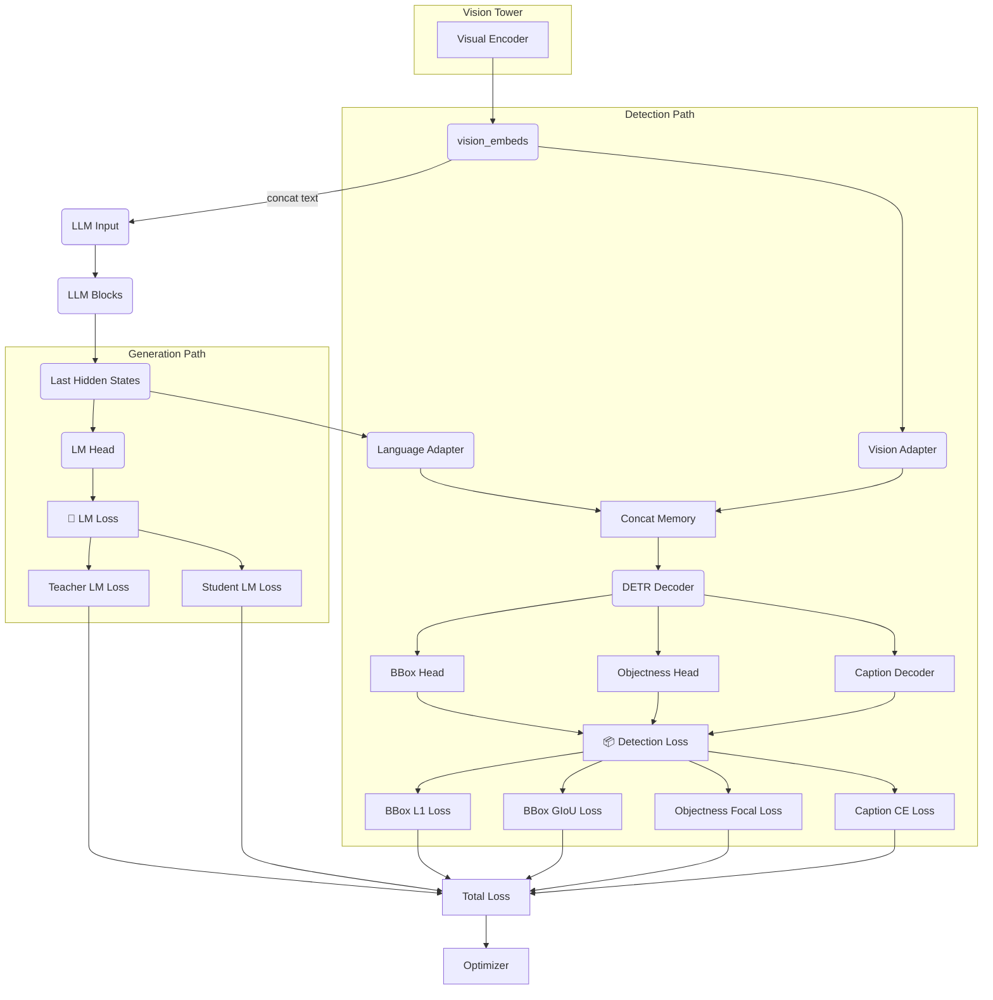

# 🏗️ Architecture & Training Strategy (Refactored)

*Last updated: 2025-01-18 – Updated for new modular architecture with domain-specific configuration and training coordinators*

---
## 1. Architecture Overview


**Key Features**:
1. **Dual Supervision**: Language and detection losses both provide gradients to vision tower
2. **Teacher-Student Splitting**: LM loss automatically split by conversation spans
3. **Multi-Component Detection**: L1, GIoU, objectness (focal), and caption losses
4. **Differential LR**: 5 parameter groups with independent learning rates

---
## 2. DetectionHead Architecture (Current Implementation)

### Core Components:
- **Object Queries**: `num_queries × d_model` learnable embeddings (default: 100 queries)
- **DETR Decoder**: Multi-layer Transformer with cross-attention
- **Multi-Head Output**: Bbox + Objectness + Caption heads

### Detailed Structure:
```python
# From src/models/detection_head.py
class DetectionHead(nn.Module):
    def __init__(self, hidden_size=3584, num_queries=100, ...):
        # Vision & Language Adapters
        self.vision_adapter = ResidualMLPAdapter(bottleneck_ratio=8)
        self.language_adapter = ResidualMLPAdapter(bottleneck_ratio=8)
        
        # DETR Decoder (configurable layers)
        self.decoder = nn.TransformerDecoder(
            decoder_layer, num_layers=detection_decoder_num_layers
        )
        
        # Task-specific heads
        self.bbox_head = nn.Sequential(nn.Linear(...), nn.Sigmoid())
        self.objectness_head = nn.Linear(...)
        self.caption_decoder = nn.TransformerDecoder(...)
        self.caption_head = nn.Linear(hidden_size, vocab_size)
```

### Output Format:
- **Bounding Boxes**: Normalized `[cx, cy, w, h]` coordinates (0-1 range)
- **Objectness**: Binary presence probability per query
- **Captions**: Token sequence per detected object
- **Raw Outputs**: Pre-sigmoid bbox coordinates for loss computation

---
## 3. Teacher-Student Loss Implementation

### Conversation Structure:
```
System: <system_prompt>
User: <teacher_image_1>
Assistant: <teacher_response_1>    # → Teacher LM Loss
User: <teacher_image_2>  
Assistant: <teacher_response_2>    # → Teacher LM Loss
User: <student_image>
Assistant: <student_response>      # → Student LM Loss + Detection Loss
```

### Implementation Details:
1. **Span Extraction**: `ChatProcessor._extract_assistant_token_spans()` identifies teacher/student spans
2. **Loss Splitting**: `BBUTrainer._compute_teacher_student_losses()` computes separate CE losses
3. **Token Alignment**: Handles both StandardDataCollator and PackedDataCollator
4. **Gradient Flow**: Both teacher and student losses contribute to total LM loss

### Key Benefits:
- **Ablation Studies**: Quantify teacher vs student learning contributions
- **Training Diagnostics**: Monitor teacher/student learning curves independently
- **Research Insights**: Analyze effectiveness of teacher-student paradigm

---
## 4. Multi-Task Loss Function

### Loss Components:
| Component | Formula | Weight Parameter | Normalization |
|-----------|---------|------------------|---------------|
| **Teacher LM** | CrossEntropy(teacher_spans) | Part of `lm_loss` | ÷ teacher_tokens |
| **Student LM** | CrossEntropy(student_spans) | Part of `lm_loss` | ÷ student_tokens |
| **BBox L1** | L1(pred_bbox, gt_bbox) | `detection_bbox_weight` | ÷ num_gt_objects |
| **BBox GIoU** | 1 - GIoU(pred_bbox, gt_bbox) | `detection_giou_weight` | ÷ num_gt_objects |
| **Objectness** | FocalLoss(pred_obj, gt_obj) | `detection_objectness_weight` | ÷ batch_size |
| **Caption** | CrossEntropy(pred_tokens, gt_tokens) | `detection_caption_weight` | ÷ batch_size |

### Total Loss Computation:
```python
total_loss = (teacher_lm_loss + student_lm_loss) + \
             detection_bbox_weight * bbox_l1_loss + \
             detection_giou_weight * bbox_giou_loss + \
             detection_objectness_weight * objectness_loss + \
             detection_caption_weight * caption_loss
```

---
## 5. Parameter Groups & Optimization

### Automatic Parameter Assignment:
```python
# From src/training/trainer.py - init_param_groups()
parameter_groups = {
    'vision': {'params': [], 'lr': config.vision_lr},      # visual.*
    'merger': {'params': [], 'lr': config.merger_lr},      # merger.*
    'llm': {'params': [], 'lr': config.llm_lr},           # model.*, lm_head.*
    'detection': {'params': [], 'lr': config.detection_lr}, # detection_head.*
    'adapter': {'params': [], 'lr': config.adapter_lr},    # *adapter*
}
```

### Fail-Fast Validation:
- Every trainable parameter must match one of the regex patterns
- Unmatched parameters raise `KeyError` during trainer initialization
- Supports differential learning rates and selective freezing

### Training Schedule Options:
1. **Uniform LR**: Set all `*_lr` to same value
2. **Differential LR**: Different rates for different components
3. **Selective Freezing**: Set `*_lr: 0` to freeze parameter groups
4. **Dynamic Freezing**: `detection_freeze_epochs` for staged training

---
## 6. Current Training Pipeline (BBUTrainer)

### Key Features:
```python
class BBUTrainer(Trainer):
    # Enhanced loss computation with teacher-student splitting
    def compute_loss(self, model, inputs, return_outputs=False):
        # 1. Standard model forward pass
        outputs = model(**model_inputs, output_hidden_states=True)
        
        # 2. Compute and split LM loss
        lm_loss = outputs.loss
        if teacher/student spans present:
            teacher_loss, student_loss = self._compute_teacher_student_losses(...)
        
        # 3. Detection loss (if enabled)
        if self.config.detection_enabled:
            detection_loss = self.detection_loss(...)
            
        # 4. Combine losses
        total_loss = lm_loss + detection_loss
        return total_loss
```

### Enhanced Logging:
- **Per-Component Losses**: Separate tracking for all loss components
- **Gradient Norms**: Per-parameter-group gradient monitoring
- **Weight Norms**: Parameter magnitude tracking
- **Teacher-Student Metrics**: Separate teacher/student loss curves

### Monitoring Capabilities:
- **TensorBoard Integration**: All metrics auto-logged
- **NaN Detection**: Automatic NaN recovery with LR reduction
- **Memory Monitoring**: GPU memory usage tracking
- **Gradient Anomaly Detection**: Optional autograd anomaly detection

---
## 7. Data Collator Integration

### StandardDataCollator:
- **Batch Shape**: `(B, L_max)` with padding
- **Teacher-Student Spans**: Adjusted for per-sample padding offsets
- **Detection Compatibility**: Direct batch-to-sample mapping

### PackedDataCollator:
- **Batch Shape**: `(1, ΣL_i)` concatenated sequences
- **Zero Padding**: Optimal memory utilization
- **Span Adjustment**: Cumulative offset computation for concatenation
- **Cross-Sample Boundaries**: Properly masked in attention

---
## 8. Training Phases & Schedules

### Recommended Training Schedule:
| Phase | Epochs | Components | Settings |
|-------|--------|------------|----------|
| **Warm-up** | 0-1 | Vision + Merger only | `detection_freeze_epochs: 1` |
| **Joint-1** | 1-N | All components active | Full multi-task training |
| **Fine-tune** | Last 25% | Detection-focused | Reduce `llm_lr` by 10× |

### Adaptive Scheduling:
- **Learning Rate Scaling**: Automatic LR adjustment based on `collator_type`
- **Dynamic Freezing**: Component-wise epoch-based unfreezing
- **Stability Recovery**: Automatic LR/grad-norm reduction on instability

---
## 9. Model Architecture Specifications

### Base Model (Qwen2.5-VL-3B):
- **Parameters**: ~3B total parameters
- **Hidden Size**: 3584
- **Layers**: 28 transformer layers
- **Attention Heads**: 28
- **Vocabulary**: 152,064 tokens

### Detection Head:
- **Object Queries**: 100 (configurable)
- **Decoder Layers**: 2 (configurable)
- **Caption Decoder**: 4 layers (configurable)
- **Adapter Bottleneck**: 8:1 ratio (configurable)

---
## 10. Memory & Performance Optimization

### Flash Attention 2:
- **Integration**: `attn_implementation: "flash_attention_2"`
- **Packed Collator**: Zero-padding waste elimination
- **Memory Efficiency**: ~40% memory reduction vs standard attention

### Gradient Checkpointing:
- **Activation Recomputation**: Trade compute for memory
- **Deep Network Support**: Essential for 28-layer model
- **Configuration**: `gradient_checkpointing: true`

### Mixed Precision:
- **BFloat16**: `bf16: true` for training stability
- **Automatic Loss Scaling**: Built into trainer
- **NaN Recovery**: Automatic detection and recovery

---
## 11. Validation & Debugging

### Runtime Validation:
- **Tensor Shapes**: Automatic shape validation via torchtyping
- **Parameter Coverage**: All parameters assigned to optimization groups
- **Loss Consistency**: NaN detection and recovery mechanisms
- **Memory Bounds**: GPU memory monitoring and cleanup

### Debug Features:
- **Sample Logging**: First train/eval sample logging with token details
- **Gradient Visualization**: Per-group gradient norm tracking
- **Loss Component Analysis**: Individual loss component trends
- **Anomaly Detection**: Optional autograd anomaly detection mode

---
## 12. Integration Points

### HuggingFace Trainer Compatibility:
- **Standard Interface**: Inherits from `transformers.Trainer`
- **Custom Hooks**: Enhanced `compute_loss`, `log`, `_save` methods
- **DeepSpeed Integration**: ZeRO-2/3 compatibility
- **Evaluation Loop**: Sandboxed evaluation with state preservation

### Configuration Integration:
- **DirectConfig System**: Single YAML source of truth
- **Parameter Validation**: Comprehensive parameter validation
- **Auto-scaling**: Automatic LR scaling based on configuration

---
This architecture provides a robust, scalable foundation for multi-task vision-language learning with comprehensive monitoring and fail-safe mechanisms. 🚀 