# Integrating PEFT into Qwen 2.5-VL-Detection
> **Status (2025-06-29)** — Design draft (implementation *pending*).  Refer to README for roadmap and avoid relying on this doc for current training runs.

## 0 – Scope of this note
This document records the reasoning and concrete plan for replacing/augmenting our **hand-rolled adapters** (`src/models/detection_adapter.py`) with **HuggingFace PEFT** modules while **preserving Qwen-2.5-VL's core language abilities**.

*Repository commit baseline: `HEAD` prior to adding PEFT.*

---
## 1 – Architecture & PEFT Injection Points

```mermaid
graph TD
    subgraph "Vision Tower"
        VT[Vision Encoder<br/>ViT-based]
        VT --> VE[vision_embeds<br/>B×P×D]
    end
    
    subgraph "Language Model Backbone"
        TE[Token Embeddings] --> LLM_IN[LLM Input<br/>B×S×D]
        VE -->|concat| LLM_IN
        
        subgraph "Transformer Layers (28 layers for 3B)"
            L1[Layer 1<br/>Self-Attn + FFN]
            L2[Layer 2<br/>Self-Attn + FFN] 
            LN[Layer N<br/>Self-Attn + FFN]
            L1 --> L2
            L2 --> LN
        end
        
        LLM_IN --> L1
        LN --> HS[hidden_states<br/>B×S×D]
    end
    
    subgraph "Generation Head"
        HS --> LM_HEAD[LM Head<br/>Linear D→Vocab]
        LM_HEAD --> LM_LOSS[🤖 LM Loss<br/>CrossEntropy]
    end
    
    subgraph "Detection Pipeline"
        VE --> VA[Vision Adapter<br/>Residual MLP<br/>D→bottleneck→D]
        HS --> LA[Language Adapter<br/>Residual MLP<br/>D→bottleneck→D]
        
        VA --> MEM[Memory Concat<br/>vision + language]
        LA --> MEM
        
        OQ[Object Queries<br/>N×D learnable] --> DECODER
        MEM --> DECODER[DETR Decoder<br/>6-layer Transformer<br/>Cross-Attention]
        
        DECODER --> BBOX[BBox Head<br/>Linear→Sigmoid<br/>→ cx,cy,w,h]
        DECODER --> OBJ[Objectness Head<br/>Linear→BCE<br/>→ presence prob]
        DECODER --> CAP_DEC[Caption Decoder<br/>4-layer Transformer]
        CAP_DEC --> CAP[Caption Head<br/>Linear→Vocab<br/>→ token logits]
        
        BBOX --> DET_LOSS[📦 Detection Loss<br/>Hungarian + Multi-task]
        OBJ --> DET_LOSS
        CAP --> DET_LOSS
    end
    
    subgraph "🎯 PEFT Injection Points"
        LORA1[LoRA Adapters<br/>r=16, α=32<br/>Applied to:]
        LORA1 -.-> |q_proj, k_proj, v_proj| L1
        LORA1 -.-> |o_proj| L1
        LORA1 -.-> |gate_proj, up_proj| L1
        LORA1 -.-> |down_proj| L1
        
        LORA2[Same LoRA pattern<br/>applied to ALL layers]
        LORA2 -.-> L2
        LORA2 -.-> LN
        
        PROMPT[Optional Soft Prompt<br/>16-32 virtual tokens<br/>Prepended to input]
        PROMPT -.-> LLM_IN
    end
    
    LM_LOSS --> TOTAL[Total Loss = LM + Detection]
    DET_LOSS --> TOTAL
    TOTAL --> OPT[Optimizer<br/>Differential LRs]
    
    classDef peftNode fill:#ff9999,stroke:#333,stroke-width:2px
    classDef adapterNode fill:#99ccff,stroke:#333,stroke-width:2px
    classDef lossNode fill:#ffcc99,stroke:#333,stroke-width:2px
    
    class LORA1,LORA2,PROMPT peftNode;
    class VA,LA adapterNode;
    class LM_LOSS,DET_LOSS,TOTAL lossNode;
```



**Key PEFT Integration Points:**
1. **LoRA Adapters** inject into every Transformer layer's attention & FFN modules
2. **Soft Prompts** (optional) prepend virtual tokens to input sequence
3. **Existing Adapters** (Vision/Language) remain unchanged - they handle cross-modal feature transformation
4. **Gradient Flow**: PEFT parameters receive gradients from both LM loss and Detection loss

---
## 2 – Current architecture recap (after full source review)
Component | Implementation | Trainable today? | Notes
---|---|---|---
Backbone (Qwen-2.5-VL LLM) | `Qwen2_5_VLForConditionalGeneration` loaded in `src/models/wrapper.py:57` | **Yes/No** via `llm_lr` config | Unmodified HF model, patches applied via `src/models/patches.py`.
Vision blocks | Part of LLM vision tower, fixed architecture | Depends on `vision_lr` | Patched for RoPE & safety.
DetectionAdapter | Residual MLP bottleneck in `src/models/detection_adapter.py` (36 lines) | **Yes** via `adapter_lr` | Hidden-size → bottleneck → hidden-size (+ residual).
Detection head (decoders, bbox / objectness / caption heads) | Custom code in `src/models/detection_head.py` (606 lines) | **Yes** via `detection_lr` | Pure task-specific parameters.

**Current Status**: PEFT v0.15.1 is already installed. No PEFT / LoRA / soft-prompt modules are currently referenced anywhere in `src/**`.

---
## 3 – Design goals (Updated for Limited Dataset <1K samples)
1. **Prevent catastrophic forgetting** → Freeze base weights completely; only train lightweight adapters
2. **Maximize sample efficiency** → Use aggressive regularization and conservative hyperparameters  
3. **Leverage pre-trained knowledge** → Keep LoRA rank low to force reuse of existing representations
4. **Enable domain-specific adaptation** → Use soft prompts for BBU-specific context steering
5. **Preserve existing training infrastructure** in `src/training/trainer.py`

---
## 4 – Technique selection rationale (Updated for <1K samples)
Technique | Pros | Cons | Verdict for limited data
---|---|---|---
Full fine-tune | Max capacity | **Severe overfitting with <1K samples** | ❌ **Avoid completely**
LoRA (r=8-16) | Prevents overfitting, forces reuse | May underfit complex patterns | ✅ **Primary choice, start r=8**
LoRA (r=32+) | More capacity | Higher overfitting risk | ⚠️ **Only if r=8 underperforms**
Soft prompts (16-32 tokens) | Domain steering, minimal params | Sequence length overhead | ✅ **Recommended for BBU context**
AdaLoRA | Adaptive rank allocation | Complex, may not help with <1K | ❌ **Skip for simplicity**

=> **Optimized mix for <1K samples**
* **Conservative LoRA**: r=8, α=16, dropout=0.1 (higher dropout for regularization)
* **Domain soft prompts**: 16 tokens with BBU-specific initialization
* **Detection head**: Keep full training (already <2% of total params)
* **Aggressive regularization**: Higher weight decay, gradient clipping

---
## 5 – Implementation plan
### 5.1 Dependencies
PEFT v0.15.1 is already available in the `ms` conda environment. No additional installations required.

### 5.2 Config additions (`src/config/global_config.py` + `configs/base_flat.yaml`)

**New fields to add to `DirectConfig` dataclass:**
```python
# PEFT Configuration (Optimized for <1K samples)
lora_enabled: bool                    # Enable/disable LoRA
lora_r: int                          # LoRA rank (start with 8)
lora_alpha: int                      # LoRA scaling parameter (start with 16)
lora_dropout: float                  # LoRA dropout rate (higher for regularization)
lora_target_modules: List[str]       # Target modules for LoRA
lora_bias: str                       # LoRA bias handling ("none", "all", "lora_only")
lora_task_type: str                  # Task type for PEFT ("CAUSAL_LM")

# Soft Prompting (Recommended for domain adaptation)
prompt_tuning_enabled: bool          # Enable/disable prompt tuning
num_virtual_tokens: int              # Number of virtual tokens (16 for BBU context)
prompt_tuning_init_method: str       # Initialization method ("text" recommended)
prompt_tuning_init_text: str         # BBU-specific initialization text
```

**New fields to add to `configs/base_flat.yaml` (Conservative settings):**
```yaml
# --- PEFT Configuration (Optimized for <1K samples) ---
lora_enabled: true
lora_r: 8                           # Conservative rank to prevent overfitting
lora_alpha: 16                      # Lower alpha for stability
lora_dropout: 0.1                   # Higher dropout for regularization
lora_target_modules: ["q_proj", "k_proj", "v_proj", "o_proj", "gate_proj", "up_proj", "down_proj"]
lora_bias: "none"
lora_task_type: "CAUSAL_LM"

# --- Soft Prompting (BBU Domain Context) ---
prompt_tuning_enabled: true
num_virtual_tokens: 16
prompt_tuning_init_method: "text"
prompt_tuning_init_text: "这是BBU基站设备检测任务，重点关注螺丝连接点、线缆、标签贴纸等关键部件的安装状态和连接情况。"

# --- Enhanced Regularization for Limited Data ---
weight_decay: 0.01                  # Increased from 0.001
max_grad_norm: 0.3                  # Reduced from 0.5 for stability
warmup_ratio: 0.2                   # Increased warmup for stability
```

### 5.3 Code changes (detailed implementation)

**File: `src/models/wrapper.py`**
- **Location**: After line 62 (after `apply_comprehensive_qwen25_fixes()`)
- **Change**: Inject PEFT configuration

```python
# CRITICAL: Apply fixes for mRoPE and visual processing
apply_comprehensive_qwen25_fixes()

# Apply PEFT configuration if enabled
if config.lora_enabled:
    self._apply_lora_config()

if config.prompt_tuning_enabled and config.num_virtual_tokens > 0:
    self._apply_prompt_tuning_config()
```

- **New methods to add**:
```python
def _apply_lora_config(self) -> None:
    """Apply LoRA configuration to the base model."""
    from peft import LoraConfig, get_peft_model
    
    lora_config = LoraConfig(
        r=self._custom_config.lora_r,
        lora_alpha=self._custom_config.lora_alpha,
        target_modules=self._custom_config.lora_target_modules,
        lora_dropout=self._custom_config.lora_dropout,
        bias=self._custom_config.lora_bias,
        task_type=self._custom_config.lora_task_type,
    )
    
    self.base_model = get_peft_model(self.base_model, lora_config)
    self.logger.info(f"✅ Applied LoRA with r={lora_config.r}, α={lora_config.lora_alpha}")

def _apply_prompt_tuning_config(self) -> None:
    """Apply prompt tuning configuration to the base model."""
    from peft import PromptTuningConfig, get_peft_model
    
    prompt_config = PromptTuningConfig(
        task_type=self._custom_config.lora_task_type,
        num_virtual_tokens=self._custom_config.num_virtual_tokens,
        prompt_tuning_init=self._custom_config.prompt_tuning_init_method,
        prompt_tuning_init_text=self._custom_config.prompt_tuning_init_text if self._custom_config.prompt_tuning_init_method == "text" else None,
    )
    
    self.base_model = get_peft_model(self.base_model, prompt_config)
    self.logger.info(f"✅ Applied prompt tuning with {prompt_config.num_virtual_tokens} virtual tokens")

def print_trainable_parameters(self) -> None:
    """Print the number of trainable parameters in the model."""
    if hasattr(self.base_model, 'print_trainable_parameters'):
        self.base_model.print_trainable_parameters()
    else:
        trainable_params = sum(p.numel() for p in self.base_model.parameters() if p.requires_grad)
        total_params = sum(p.numel() for p in self.base_model.parameters())
        print(f"Trainable params: {trainable_params:,} || Total params: {total_params:,} || Trainable%: {100 * trainable_params / total_params:.2f}")
```

**File: `src/training/trainer.py`**
- **Location**: After line 200 (in `__init__` method after special tokens setup)
- **Change**: Add PEFT parameter monitoring

```python
# Print trainable parameters if PEFT is enabled
if hasattr(self.model, 'print_trainable_parameters'):
    self.logger.info("📊 Model parameter breakdown:")
    self.model.print_trainable_parameters()
```

- **Location**: In `init_param_groups` method (around line 402)
- **Change**: Ensure PEFT parameters are included in optimizer groups

```python
def init_param_groups(self) -> None:
    """Initialize parameter groups with different learning rates for different components."""
    param_groups = []
    
    # Get all named parameters
    all_named_params = dict(self.model.named_parameters())
    
    # Track which parameters have been assigned
    assigned_params = set()
    
    # PEFT parameters (LoRA adapters, prompt embeddings)
    if self.config.lora_enabled and self.config.llm_lr > 0:
        peft_params = []
        for name, param in all_named_params.items():
            if any(peft_key in name for peft_key in ['lora_', 'prompt_embeddings']):
                if param.requires_grad:
                    peft_params.append(param)
                    assigned_params.add(name)
        
        if peft_params:
            param_groups.append({
                'params': peft_params,
                'lr': self.config.llm_lr,
                'name': 'peft_params'
            })
            self.logger.info(f"📊 PEFT parameters: {len(peft_params)} params with LR {self.config.llm_lr}")
    
    # ... existing parameter group logic continues ...
```

**File: `src/models/wrapper.py` - save/load methods**
- **Location**: Update `save_pretrained` method (around line 539)
- **Change**: Ensure PEFT adapters are saved

```python
def save_pretrained(self, save_directory: str, **kwargs):
    """Save the model and all components."""
    import os
    from pathlib import Path
    
    save_path = Path(save_directory)
    save_path.mkdir(parents=True, exist_ok=True)
    
    # Save base model (includes PEFT adapters automatically)
    self.base_model.save_pretrained(save_path, **kwargs)
    
    # Save detection head if it exists
    if self.detection_head is not None:
        self.save_detection_head_weights(str(save_path))
    
    # Save our custom config
    config_path = save_path / "wrapper_config.json"
    with open(config_path, 'w') as f:
        json.dump({
            'detection_enabled': self.detection_enabled,
            'has_detection_head': self.detection_head is not None,
            'peft_enabled': hasattr(self.base_model, 'peft_config'),
        }, f, indent=2)
```

- **Location**: Update `from_pretrained` class method (around line 259)
- **Change**: Handle PEFT adapter loading

```python
@classmethod
def from_pretrained(
    cls,
    model_path: str,
    num_queries: int = None,
    max_caption_length: int = None,
    tokenizer=None,
    load_detection_head: bool = True,
    **kwargs,
):
    """Load model with PEFT adapters if present."""
    from pathlib import Path
    
    model_path = Path(model_path)
    
    # Check if PEFT adapters exist
    adapter_config_path = model_path / "adapter_config.json"
    has_peft_adapters = adapter_config_path.exists()
    
    if has_peft_adapters:
        # Load model with PEFT adapters
        from peft import AutoPeftModelForCausalLM
        base_model = AutoPeftModelForCausalLM.from_pretrained(
            str(model_path),
            torch_dtype=_get_torch_dtype(config.torch_dtype),
            attn_implementation=config.attn_implementation,
        )
        
        # Create wrapper instance
        instance = cls.__new__(cls)
        instance.tokenizer = tokenizer
        instance.base_model = base_model
        
        # Apply patches
        apply_comprehensive_qwen25_fixes()
        
        # Initialize detection head if needed
        if load_detection_head and config.detection_enabled:
            instance.detection_enabled = True
            instance._init_detection_head()
            instance.detection_head.set_token_embedding(
                instance.base_model.get_input_embeddings()
            )
        else:
            instance.detection_enabled = False
            instance.detection_head = None
        
        instance._custom_config = config
        
        return instance
    else:
        # Fall back to existing loading logic
        return cls._load_base_model(model_path, num_queries, max_caption_length, tokenizer, **kwargs)
```

### 5.4 Training schedule refinement (Optimized for <1K samples)

The existing training infrastructure in `src/training/trainer.py` already supports differential learning rates. The PEFT integration will work with the current parameter grouping system:

Phase | Epochs | Trainable params | LR configuration | Rationale
---|---|---|---|---
Stabilize head | 0–5 | detection head + adapters only | `detection_lr=1e-4`, `adapter_lr=5e-4`; `llm_lr=0` | Let task-specific components adapt first
Conservative PEFT | 5–15 | + LoRA (r=8) + prompt | `llm_lr=1e-5` (very conservative) | Gradual base model adaptation  
Joint training | 15–25 | All components | `llm_lr=5e-6`, maintain other LRs | Fine-tune all together
Early stopping | Monitor validation | Stop if no improvement for 3 epochs | Prevent overfitting | Critical for limited data

### 5.5 Performance optimization strategies for <1K samples

**A. Data Augmentation & Regularization**
```yaml
# Enhanced training settings for limited data
num_train_epochs: 25                # Reduced from 30
eval_steps: 5                       # More frequent evaluation  
save_steps: 10                      # More frequent checkpointing
early_stopping_patience: 3          # Stop if val loss plateaus
```

**B. Teacher Forcing & Few-Shot Learning**
```yaml
# Leverage teacher pool more aggressively
teacher_ratio: 0.9                  # Increased from 0.7
num_teacher_samples: 2              # More examples per batch
use_candidates: true                # Use candidate phrases for consistency
```

**C. Detection Loss Rebalancing**
```yaml
# Adjust loss weights for limited data
detection_caption_weight: 0.05      # Increased from 0.02 (more caption supervision)
detection_bbox_weight: 5.0          # Reduced from 10.0 (less aggressive bbox training)
detection_objectness_weight: 5.0    # Reduced from 10.0
```

### 5.6 Inference toggles

```python
# Enable generic chat (disable domain-specific adaptations)
if hasattr(model.base_model, 'disable_adapter_layers'):
    model.base_model.disable_adapter_layers()

# Enable domain captioning (enable adaptations)
if hasattr(model.base_model, 'enable_adapter_layers'):
    model.base_model.enable_adapter_layers()

# Merge and unload adapters for deployment
merged_model = model.base_model.merge_and_unload()
```

### 5.7 Checkpoint management

The existing checkpoint system in `src/training/trainer.py` will automatically handle PEFT adapter files:
- `adapter_config.json` - PEFT configuration
- `adapter_model.safetensors` - LoRA weights (~1-5MB for r=8)
- `prompt_embeddings.safetensors` - Prompt tuning embeddings (~1MB for 16 tokens)

---
## 6 – File/Code preservation considerations
* `src/models/detection_adapter.py` **stays unchanged** – it handles vision-to-language feature transformation; LoRA only augments language layers.
* `src/training/trainer.py` parameter grouping logic **extends** to include PEFT params.
* `src/models/patches.py` **remains critical** – must be applied before PEFT wrapping.
* No conflicts with existing `BBUTrainer` loss computation or logging infrastructure.

---
## 7 – Risk & mitigation (Updated for limited data)
Risk | Mitigation | Monitoring | Priority
---|---|---|---
**Overfitting with <1K samples** | Conservative LoRA rank (r=8), high dropout (0.1), early stopping | Val loss plateau, train/val gap | 🔥 **Critical**
LoRA rank too low → underfit | Gradually increase r=8→16→32 if needed | Detection mAP & caption BLEU scores | ⚠️ **High** 
PEFT config conflicts with patches | Apply patches before PEFT wrapping | Verify `verify_qwen25_patches()` passes | ⚠️ **High**
Insufficient domain adaptation | Use BBU-specific soft prompt initialization | Qualitative caption quality | ⚠️ **Medium**
Training instability | Conservative LRs, gradient clipping | Monitor loss curves and gradient norms | ⚠️ **Medium**

---
## 8 – Task checklist (chronological)
1. ✅ Verify PEFT v0.15.1 availability in environment
2. ⏳ Extend `DirectConfig` dataclass with PEFT fields
3. ⏳ Add conservative PEFT configuration to `configs/base_flat.yaml`
4. ⏳ Implement `_apply_lora_config()` and `_apply_prompt_tuning_config()` in `wrapper.py`
5. ⏳ Update parameter grouping in `trainer.py` to include PEFT params
6. ⏳ Enhance `save_pretrained()` and `from_pretrained()` for PEFT compatibility
7. ⏳ **Critical**: Run smoke test with 50 samples, r=8, conservative LRs
8. ⏳ Verify `model.print_trainable_parameters()` shows ~1-2% trainable (lower than 3% due to r=8)
9. ⏳ Full training run with early stopping enabled
10. ⏳ If underfitting: gradually increase LoRA rank to r=16, then r=32
11. ⏳ Create deployment checkpoint with `merge_and_unload()`

---
## 9 – Expected outcomes (Updated for <1K samples)
- **Parameter efficiency**: ~1-2% trainable parameters (r=8 LoRA + 16 prompt tokens)
- **Overfitting prevention**: Conservative hyperparameters prevent memorization
- **Domain adaptation**: Soft prompts provide BBU-specific context steering
- **Sample efficiency**: Teacher forcing + few-shot learning maximize data utilization
- **Generalization**: LoRA forces reuse of pre-trained representations

**Performance expectations with <1K samples:**
- **Detection mAP**: 60-75% (vs 80%+ with larger datasets)
- **Caption quality**: Good for common BBU components, may struggle with rare cases
- **Training stability**: Should converge within 15-20 epochs with proper regularization

---
## 10 – Conclusion
The conservative LoRA + soft-prompt strategy is specifically optimized for your limited dataset scenario. The implementation:

**Prevents overfitting through:**
- Low LoRA rank (r=8) forcing representation reuse
- High dropout (0.1) and weight decay (0.01) 
- Early stopping and frequent validation
- Conservative learning rates

**Maximizes sample efficiency through:**
- BBU-specific soft prompt initialization
- Aggressive teacher sample usage (90% ratio)
- Candidate phrase consistency
- Differential loss rebalancing

**Maintains architectural integrity:**
- Existing detection pipeline unchanged
- Proven patch system preserved  
- Current training infrastructure extended

> **Next Steps**: Start with the most conservative settings (r=8, α=16) and gradually increase capacity only if validation metrics show clear underfitting.
